# Coprojer

**把需求讨论、交互原型、开发、独立验证和逐项验收放进一个本地桌面工作空间。**

Coprojer 面向个人开发者与需要工程引导的使用者，基于 Electron、React 和 TypeScript。接入自己的模型服务后，由任务规划、原型前端、开发、测试校验四类角色协作；需求、方案、实际文件修改和验收证据保留在同一个项目中。


**开发更新：2026-09-28。** 新增新手入门、阿里云快速导入、模型榜单推荐与实例推理设置、流量监控、验证条件自动准备，并改进长任务上下文与中断恢复。当前提供源码和本机运行能力。

页面下半部分保留 **2026-09-27 真实「番茄钟助手」续跑教程**，作为既有案例；案例的时间、模型、功能数量与验收结果只对应当时的隔离运行。教程图片为最大化应用截图，可点击查看原图。

> 自动验证通过后仍需使用者亲自试用和验收。支持连接不等于真实账号或所有型号都经过实测；模型用量也不等于供应商账单。

## 阅读入口

- [快速启动](#快速启动) · [首次创建与模型配置](#首次创建与模型配置)
- [今日开发更新](#2026-09-28-开发更新) · [所有功能](#所有功能) · [真实项目完整操作流程](#真实项目完整操作流程)
- [测试结果与边界](#测试结果与边界) · [开发与本地资料](#开发与本地资料)
- [文档索引](docs/README.md) · [更新记录](CHANGELOG.md) · [功能与验证矩阵](docs/FEATURE_CATALOG.md)
- [本次发布验证](docs/verification/2026-09-28-release.md) · [9 月 27 日案例证据](docs/verification/2026-09-27-pomodoro-walkthrough.md)

## 快速启动

需要 Node.js **22.12+**、npm，以及有有效凭据的模型连接。当前交付源码与本机运行能力，尚无安装包或云服务发行版。本轮环境为 Windows，其他操作系统没有在本轮实测。

```powershell
git clone https://github.com/yuyanpeng0909-cmyk/coprojer.git
cd coprojer
npm ci
npm run dev
```

Windows 安装依赖后也可双击 `start-dev.cmd`。前端修改会热更新；`npm start` 先构建再启动本地生产模式。

首次使用可从侧栏「新手入门」完成模型与四角色配置，然后按「选择或新建项目 → 描述目标 → 试用原型 → 确认需求 → 审阅方案 → 开发与验证 → 实际试用验收」推进。已有项目从项目库继续，引导可暂停、恢复，并按真实项目进度显示下一步。详见[新手入门指南](docs/ONBOARDING.md)。

## 首次创建与模型配置

### 1. 新建项目

点击「新建项目」或 `Ctrl+N`，填写名称、父目录和目标。窗口检查 Node/npm 与目录；创建使用新子目录，不覆盖同名工程。缺少模型时进入「先连接模型」，项目草稿保留。

下图为 9 月 27 日案例独立展示的创建入口，**未提交新工程**；案例主流程使用已有真实项目的副本。完整新建链路另由隔离 Electron 回归验证。

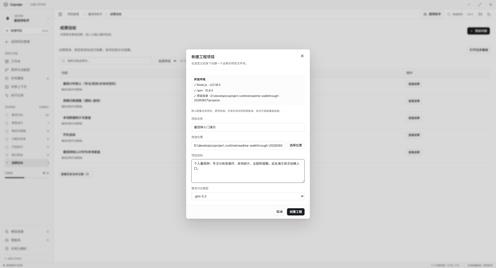

### 2. 接入模型

进入「模型连接 → 新增模型」，选择预设或自定义地址，填写 Base URL、协议、API Key 和实际模型 ID。支持 Chat Completions、Responses、Anthropic Messages；可获取型号列表，也可手填。

阿里云百炼新用户可选择「模型连接 → 阿里云快速导入」：从官方入口注册并获取北京地域普通 Key，粘贴后识别型号；登录百炼控制台授权后扫描实际免费额度，预览并一键装配未配置的助手与智能体。免费模式只接受余额有效且已开启「用完即停」的型号。已有连接、绑定和专属 Skill 保留，详见[快速导入指南](docs/ALIYUN_IMPORT.md)。

- 「测试连接」检查普通回复；「检查开发能力」检查工具往返和结构化结果。探测通过不保证所有工程任务成功。
- 首次保存模型可绑定尚未配置的默认四角色；后续按角色分别分配。
- 「复用连接」沿用地址、协议和密钥，另存具体型号。
- 默认通用助手模型用于问答、技能推荐和配置建议；支持下一次请求单独选择，工程开发与验证使用各自绑定。

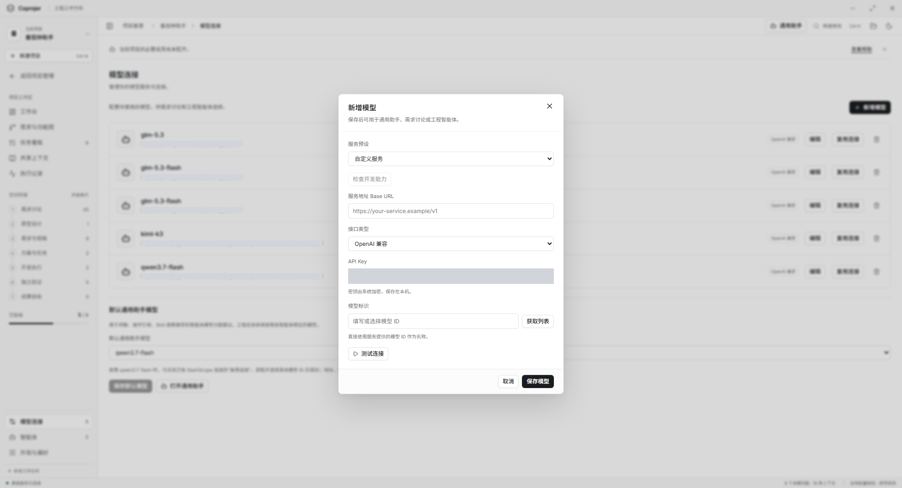

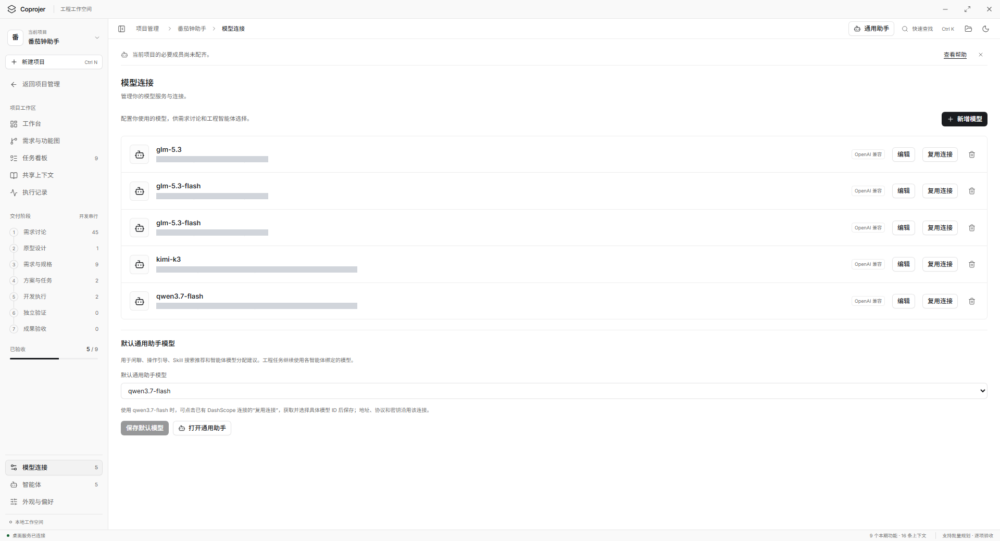

9 月 27 日案例中的开发、独立验证实际使用已配置的 `glm-5.3-flash`。其他型号是工作空间原有配置，不能据此推断其官方供应情况或能力。该案例展示新增表单，没有新增付费账户或替换原密钥。

## 2026-09-28 开发更新

| 能力 | 可以做什么 | 使用说明 |
| --- | --- | --- |
| 新手入门 | 完成配置准备，跟随真实项目逐步开发；定位操作、暂停与重启恢复 | [入门指南](docs/ONBOARDING.md) |
| 阿里云快速导入 | 识别型号、授权扫描免费额度、检查用完即停，预览后补齐未配置的助手与智能体 | [快速导入](docs/ALIYUN_IMPORT.md) |
| 能力证据推荐 | 按 AA 综合/终端编程或 Arena 专项查询证据，在已接入型号中预览、确认分配 | [推荐策略](docs/MODEL_RECOMMENDATIONS.md) |
| 实例推理设置 | 按智能体独立设置已适配型号的推理开关、档位或预算；未知型号使用服务默认 | [推理设置](docs/AGENT_REASONING.md) |
| 模型流量监控 | 按时间和连接查看请求、Token、失败率、耗时、趋势与调用明细 | [监控口径](docs/MODEL_TRAFFIC.md) |
| 验证条件自动准备 | 对未验证项诊断缺口，补充检查资料或必要开发依赖，再独立复验 | [验证准备](docs/VERIFICATION_PREPARATION.md) |
| 长任务稳定性 | 整理超大工具结果、扁平化旧摘要、归档完整日志、无进展暂停与断点恢复；显式 incomplete 或预算耗尽时阻止无效交付 | [上下文修复](docs/verification/2026-09-28-long-task-context.md) · [收敛保护](docs/verification/2026-09-28-execution-convergence.md) |

这些是本地实现范围。供应商账号、榜单证据、受控协议测试和真实项目验收分别记录；不能用测试夹具证明实际模型质量或账户余额。[更新记录](CHANGELOG.md)汇总修复，[发布验证](docs/verification/2026-09-28-release.md)给出当前发布检查结果。

### 新功能界面

以下是 9 月 28 日隔离资料和受控服务响应下的真实 Electron 最大化窗口。展示的是交互流程；型号、额度和用量为测试数据，API Key 不在截图中显示。

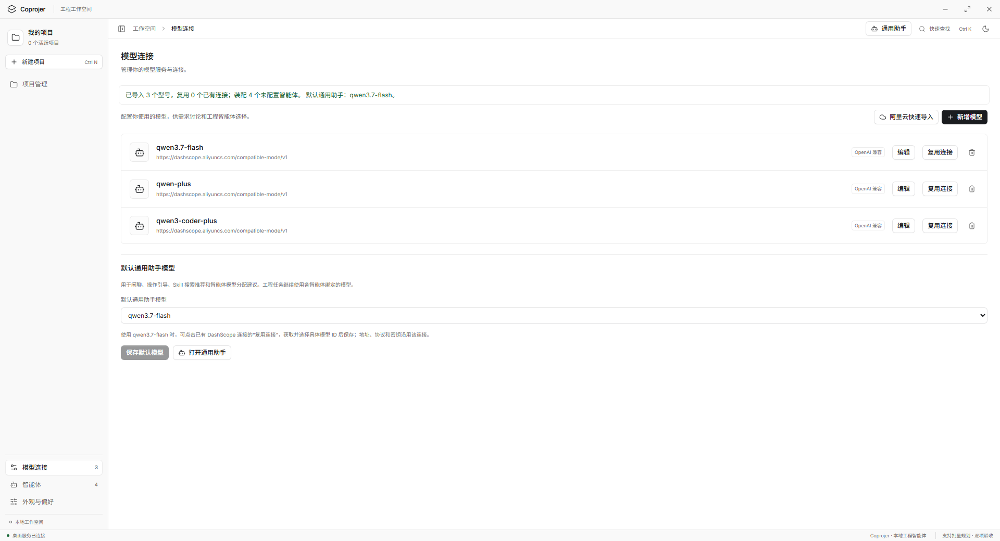

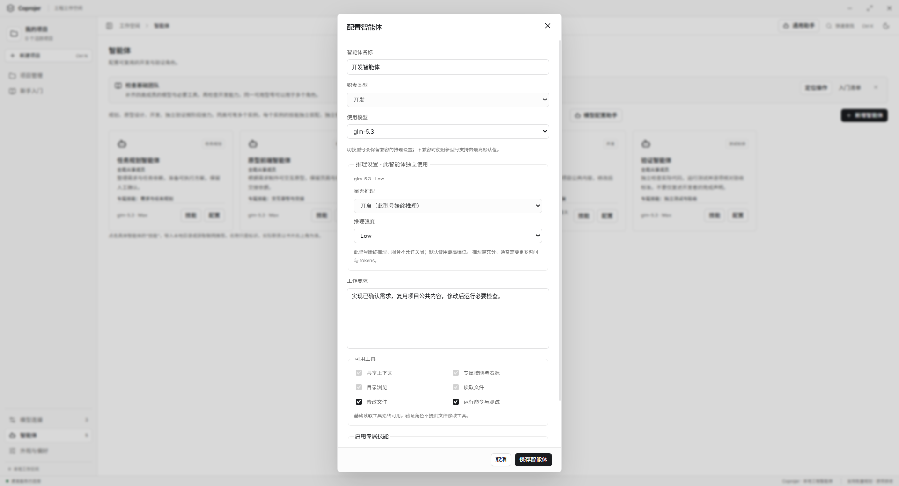

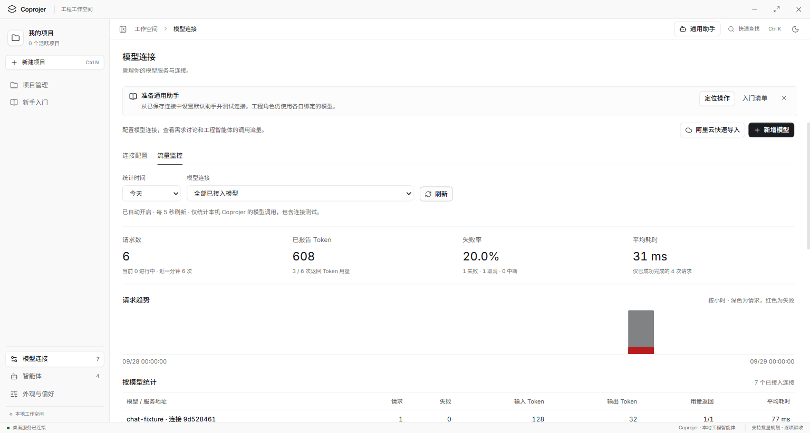

## 所有功能

以下按入口列出当前产品范围；更细的操作、测试脚本、截图与真实运行边界见[逐项功能与验证矩阵](docs/FEATURE_CATALOG.md)。

| 功能域 | 当前支持 |
| --- | --- |
| 项目库 | 新建、环境检查、草稿保留、搜索、排序、置顶、重命名、归档/恢复、项目切换、打开目录、继续开发 |
| 新手入门 | 配置检查、跟随项目与功能、逐页说明、定位操作、暂停/恢复、真实状态进度 |
| 工作台与导航 | 下一步、待办、统计、功能搜索筛选、7 阶段总览、执行状态、侧栏折叠、Ctrl+N / Ctrl+K |
| 需求与圆桌 | 流式讨论、模型切换、多模型提案/评审/汇总、反馈、实时决策卡、延期、停止/继续、重启恢复 |
| 功能图与多端 | 实时图、编辑、缩放定位、独立窗口同步、SVG/PNG/Markdown/JSON 导出、子项目目录/接口/范围 |
| 原型与规格 | 设计意见、生成迭代、历史版本、桌面/移动视图、独立窗口、导出、验收、PRD 自动提取、目录、基线锁定 |
| 方案与队列 | 单项方案、批量生成、失败重试、批量审阅、依赖检查、执行顺序规划/修正/持久化、串行开发 |
| 开发与验证 | 工具配置、文件读写、npm/Node、执行日志、前后差异、独立验证、缺口诊断/准备/复验、证据门槛、最多 3 轮修复 |
| 中断与验收 | 停止、工具回合检查点、重复无进展暂停、断网及重启恢复、未完成交付保护、过期证据失效、验收与继续队列 |
| 预览 | HTTP 网页启动/打开/停止/重启、固定端口和占用提示；原生 Electron 需外部启动 |
| 共享上下文 | 来源与修订、按功能/依赖/子项目取材、版本分页、资料预算、摘要整理、完整工具归档、调用取材记录 |
| 模型连接 | 自定义服务、三协议、预设、型号列表、普通/能力探测、连接复用、阿里云快速导入、默认/单次助手模型 |
| 模型监控 | 请求与用量、失败率、耗时、时间趋势、按连接筛选、最近调用 |
| 智能体与技能 | 四角色、多实例、工具权限、能力证据推荐/确认应用、实例推理设置、实例专属技能、本地/GitHub 安装、启停/移除/推荐 |
| 通用助手 | 项目/全局会话、问答、宽视图、搜索/重命名/置顶/归档/恢复/删除、草稿、确认偏好、团队预览/应用 |
| 外观与数据 | 明暗主题、强调色、密度、圆角、键盘焦点、减少动态效果、本地偏好、工程导出、系统加密密钥 |

### 共享上下文

追踪资料来源、有效状态和修订号，查看角色实际取材。可归档/恢复工程补充与总结；已确认基线及验收记录不能直接改写。长资料分页读取，按功能依赖和子项目取材。

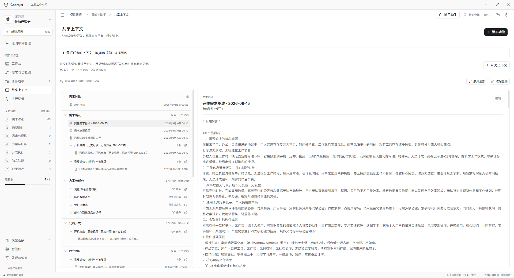

### 智能体与技能

为每个实例配置职责、模型和工具。一个职责可有多个实例，增加人数不会让代码交付自动并行。模型配置助手按所选类别查询 AA 或 Arena 公开证据，在已接入型号中按能力或能力 / 费用策略筛选；不同指标分开展示，标明来源和抓取时间，确认后才修改绑定，证据不足保留原配置。每个实例可独立设置已适配型号的推理参数。详见[能力榜单推荐](docs/MODEL_RECOMMENDATIONS.md)和[推理设置](docs/AGENT_REASONING.md)。

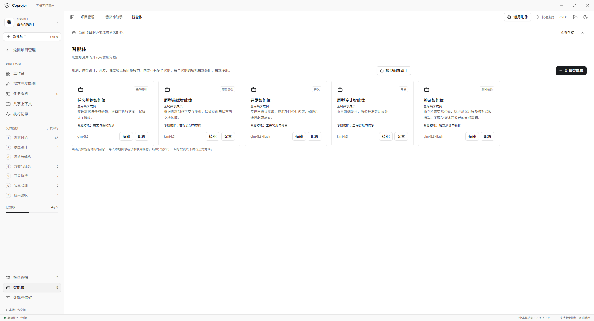

点击实例「技能」预览本地 `SKILL.md` 或公开 GitHub 包，再确认安装启用；支持联网推荐、启停、更新和移除。技能按实例隔离、按需读取，不扩大工具权限，安装时不自动执行脚本。

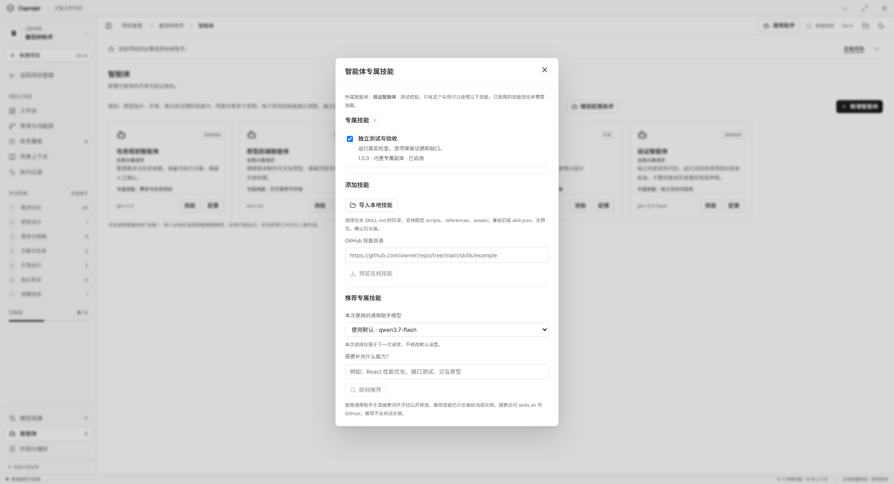

### 通用助手与团队方案

顶部助手支持项目上下文问答与操作引导。9 月 27 日案例用单次模型询问实际项目状态，得到回复并显示用模信息。回复仍需核对：助手概述的历史完成数量不应覆盖项目列表的事实，推荐下一步也不代替保存的队列。

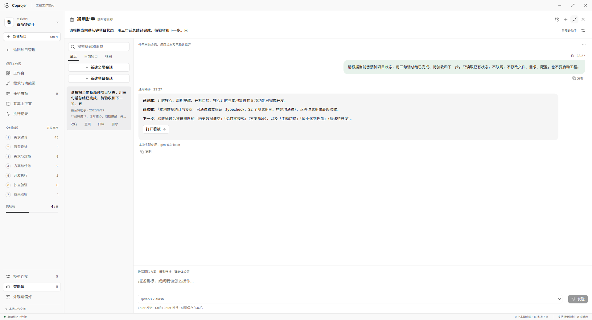

宽视图提供会话管理，关闭保留草稿，重启不自动重放中断请求。「记住」先产生候选，确认后才成为偏好。团队建议仅从已接入型号选择，预览、调整、确认应用后修改成员，不自动启动工程。

### 外观与偏好

默认使用 [UI 1.6](docs/UI_SPEC.md) 的亮色、黑白强调、紧凑密度与 6px 圆角；支持深色、强调色、密度、圆角、键盘焦点和减少动态效果。

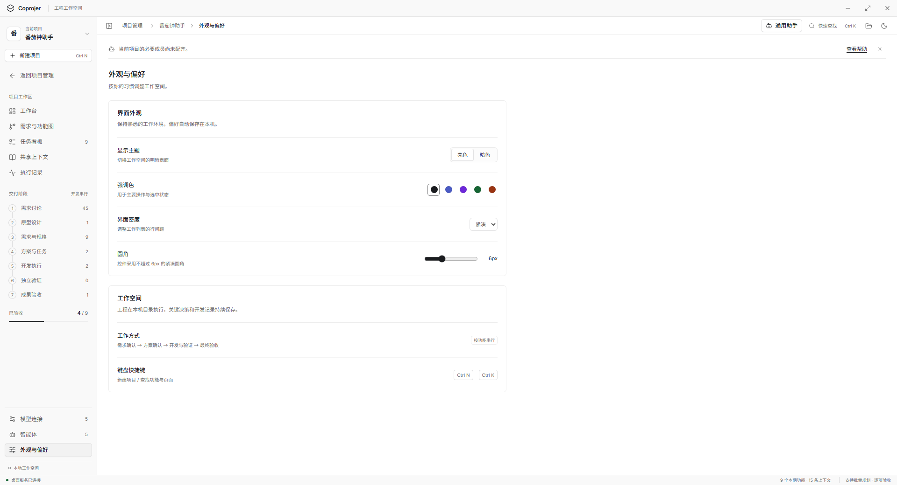

## 真实项目完整操作流程

以下为 **2026-09-27** 的隔离续跑记录，保留当时事实；并非 9 月 28 日重新运行或从零生成整个番茄钟。历史讨论中的 Tauri 是当时方案，实际程序为 Electron/React。

### 0. 隔离复制并确认起点

先复制注册的「番茄钟助手」工程和 Coprojer 资料，再以独立资料目录启动。模型凭据保留在本机加密资料中。本轮提交只包含产品修复、文档和筛选后的截图证据，不上传完整应用资料。

| 起点与结果 | 本轮记录 |
| --- | --- |
| 续跑对象 | 注册工程 `test/番茄钟助手` 的隔离副本 |
| 已有成果 | 需求、圆桌、KIMIK3 原型、规格、部分代码、4 项历史已验收状态 |
| 本次新执行 | 统计功能真实模型开发与独立验证、原生应用测试、验收操作 |
| 当前有效功能 | 9 项；另有 1 条已合并历史记录单独追溯 |
| 结束状态 | 5 项已验收、2 项就绪、2 项方案阶段 |
| 原始资料保护 | 原应用主数据及原工程既有改动哈希保持一致 |

在「项目管理」可搜索、排序、置顶、重命名、归档/恢复，打开目录或继续开发。

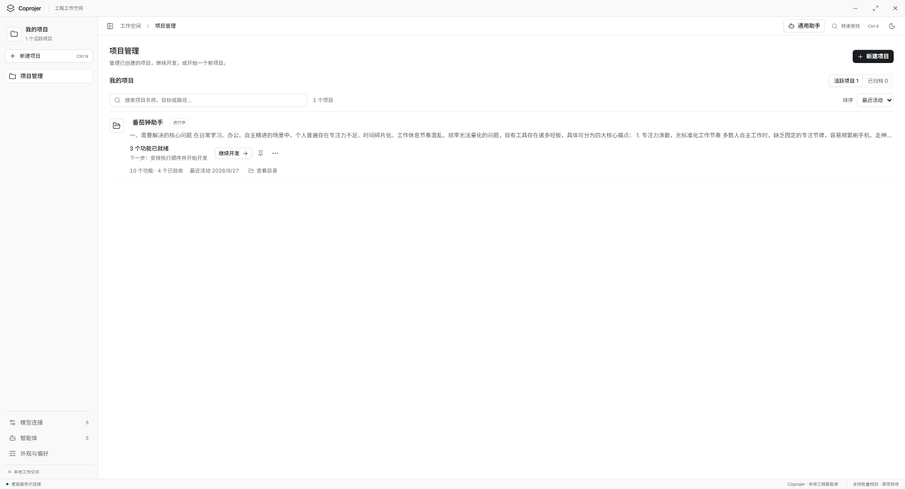

### 1. 查看已有需求与圆桌

打开「需求与功能图」或「需求讨论」。左侧保留讨论和人工反馈，右侧查看功能图、原型与子项目。支持单模型讨论和多模型圆桌，圆桌按提案、交叉评审、主持汇总推进。

需要取舍时出现决策卡：选择建议、输入想法，或「后面再说」交给后续模型研究。决定和未决事项保留，停止及重启后可继续。下图为**已有真实讨论的复查**，没有为截图重跑整场圆桌。

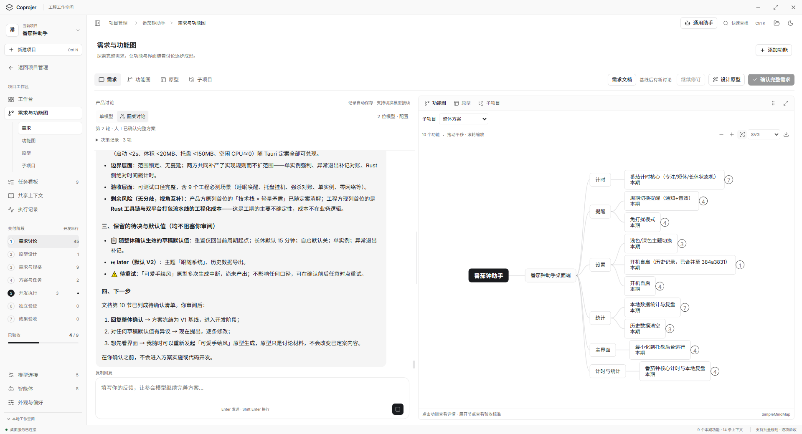

功能图支持缩放、定位、独立窗口和 SVG/PNG/Markdown/JSON 导出；多端工程可记录子项目目录、接口和职责边界。相关高级交互通过本轮协议夹具与真实 Electron 回归覆盖，见[功能矩阵](docs/FEATURE_CATALOG.md)。

### 2. 试用原型，辨认版本与依据

在「原型设计」查看历史版本、设计反馈和预览，可打开独立窗口。新项目通常先收集设计意见，生成和迭代交互原型；点击「验收此原型」后自动提取 PRD 与候选功能。

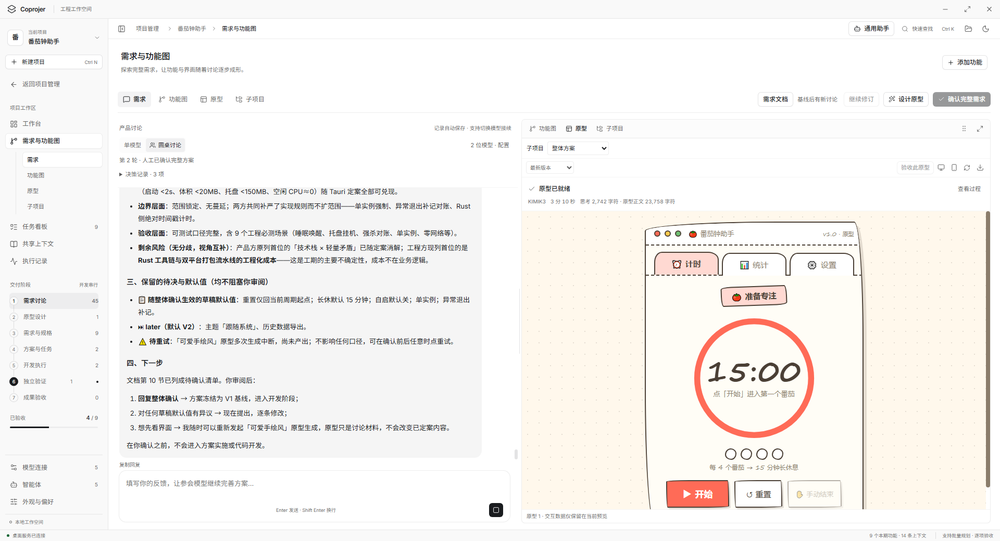

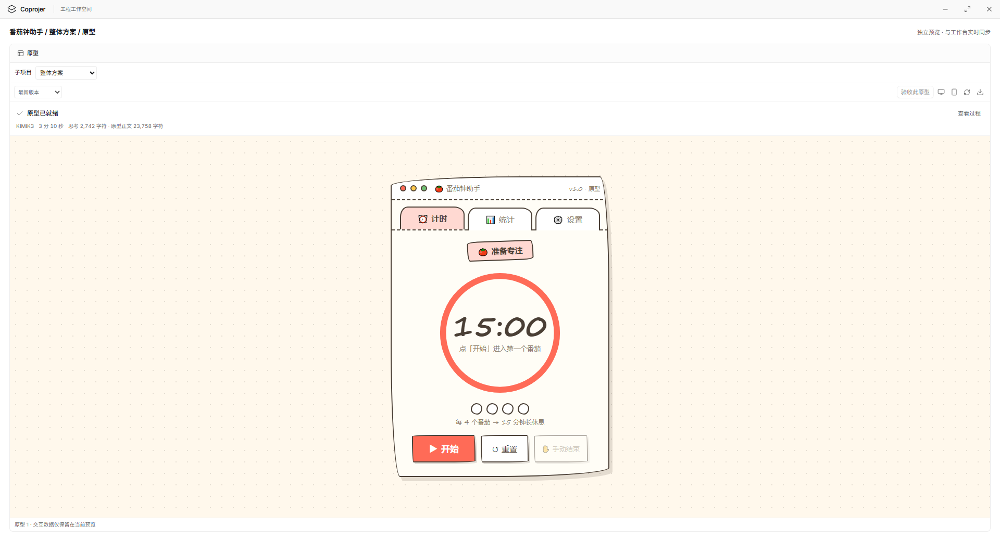

这是既有 HTML 原型，**不是后面实际运行的番茄钟程序**。本轮重新打开已有版本，没有重新生成，也没有宣称最终界面已逐像素对齐。确认基线后，方案与执行固定引用选定原型，新版本不会静默替换旧任务依据。

### 3. 审阅需求与规格

「需求与规格」集中展示 PRD、子项目、模块和功能 Spec。目录支持搜索、定位、键盘操作和滚动同步；「已核对」仅记录阅读进度。确认动作提交需求基线，审阅中内容改变时需刷新重新审阅。

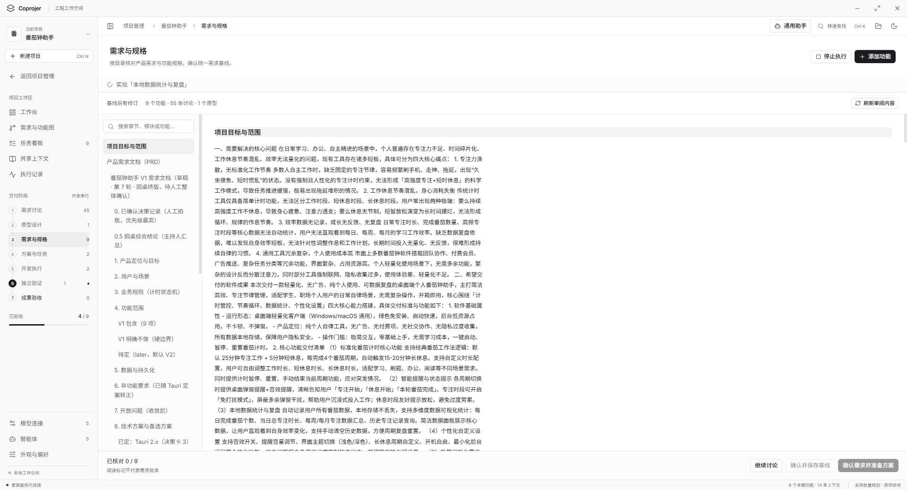

本例沿用已确认资料。历史技术讨论与实际实现存在差异，因此本页分别标注历史方案、当前代码和运行证据。

### 4. 审阅方案与执行顺序

任务看板按阶段展示功能。可逐项生成、编辑和确认方案，或批量准备方案并只重试失败项。「审阅方案并开始」一次最多选择 8 项，核对任务、验收标准和未完成依赖。

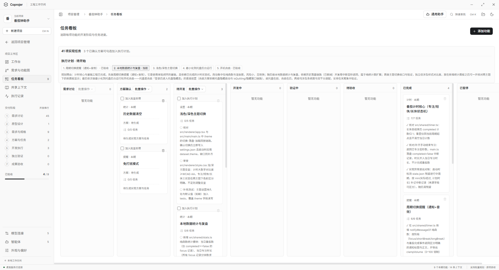

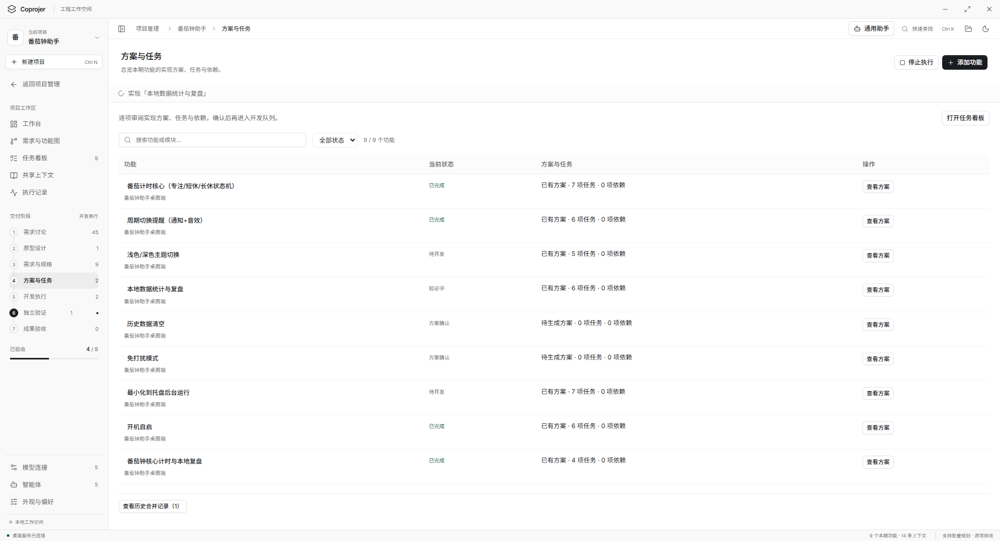

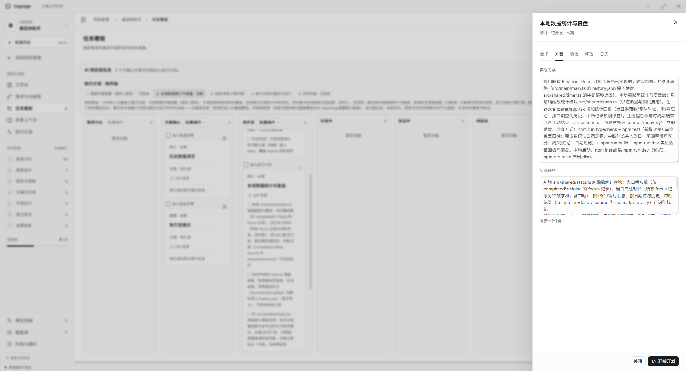

确认后按依赖**串行**交付。执行顺序可查看、调整和保存；缺失依赖与循环依赖不能直接开工。本轮选择「本地数据统计与复盘」，其余就绪功能仍保留。

### 5. 实际开始开发

在统计功能中点击「开始开发」。开发角色读取固定需求、原型和相关上下文，再执行文件工具及工程命令，记录读写、命令结果与文件修改。

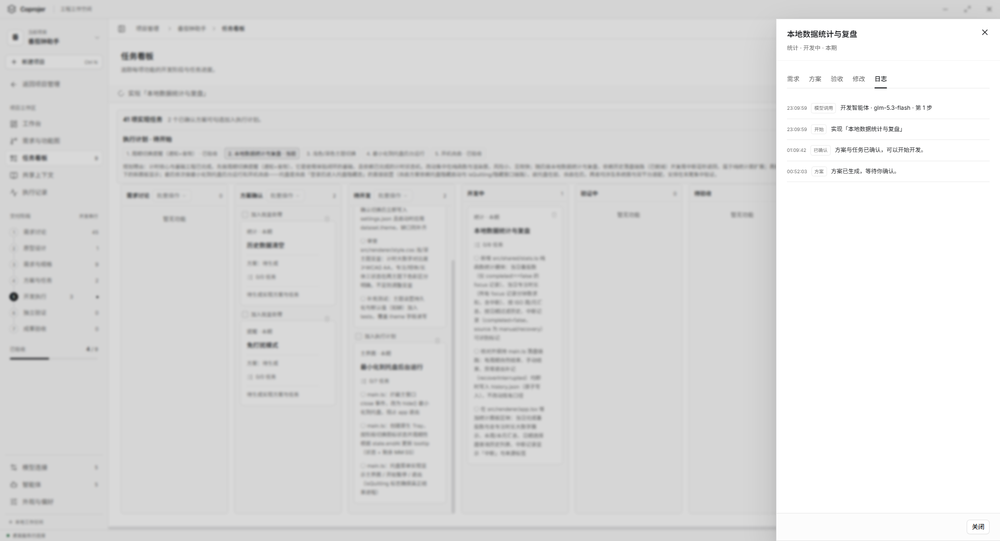

本轮新增统计逻辑与测试、调整统计界面。真实开发启动于 **2026-09-27 23:09:59（北京时间）**，文件变更发生在隔离工程。

### 6. 独立验证与修改证据

独立验证角色读取实际源码、运行检查、逐项提供证据；仅声明「完成」不会通过。失败后最多修复 3 轮，再失败则暂停。步骤预算耗尽会保存进度，支持重启后继续，不无限自动续跑。

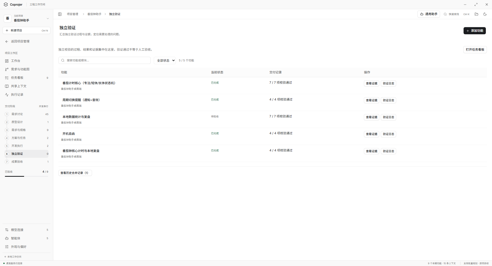

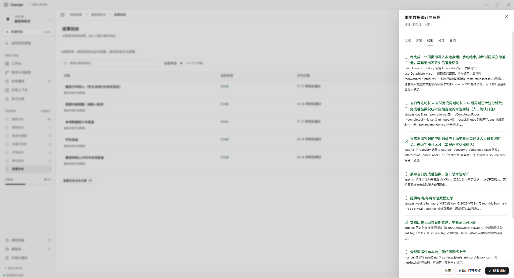

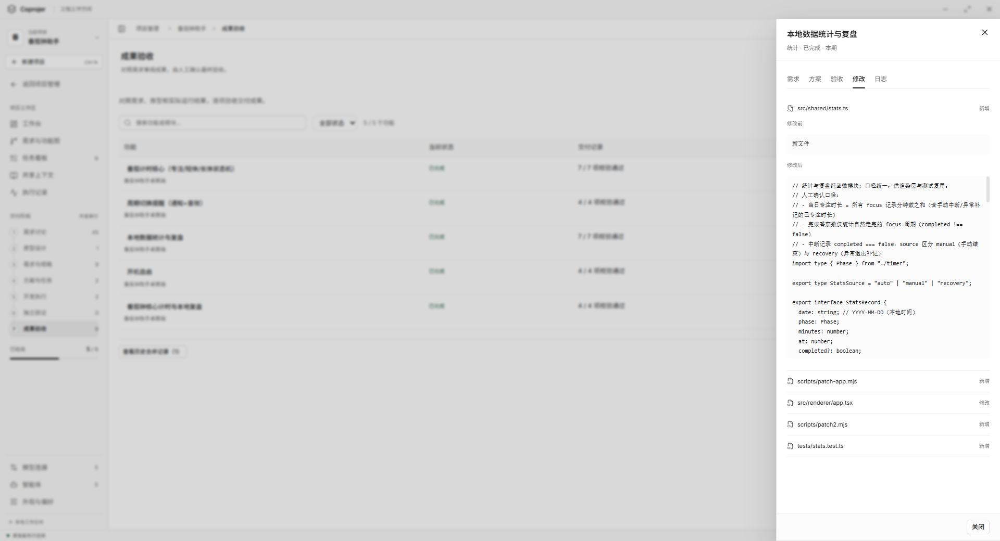

本次类型检查、**32 个 Vitest 用例（含 9 个统计用例）**和构建通过，7 项验收条件记录证据，自动修复 **0/3**。验证角色明确说明未截图检查界面，因此继续独立启动实际程序测试。

### 7. 启动真实番茄钟并检查交互

Coprojer 内置「启动并打开预览」面向接受 `--host` / `--port` 参数的 **HTTP 网页工程**。本例是原生 Electron，通过本机命令启动已构建程序，并使用独立应用数据目录；不将其记作内置 HTTP 预览成功。

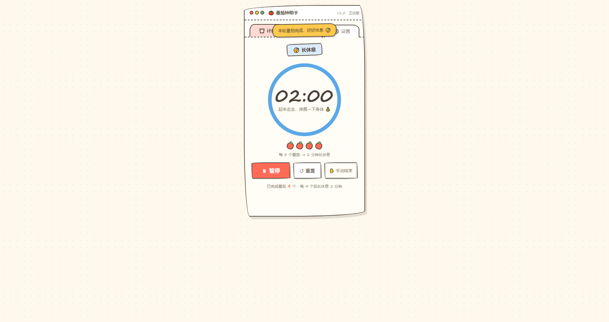

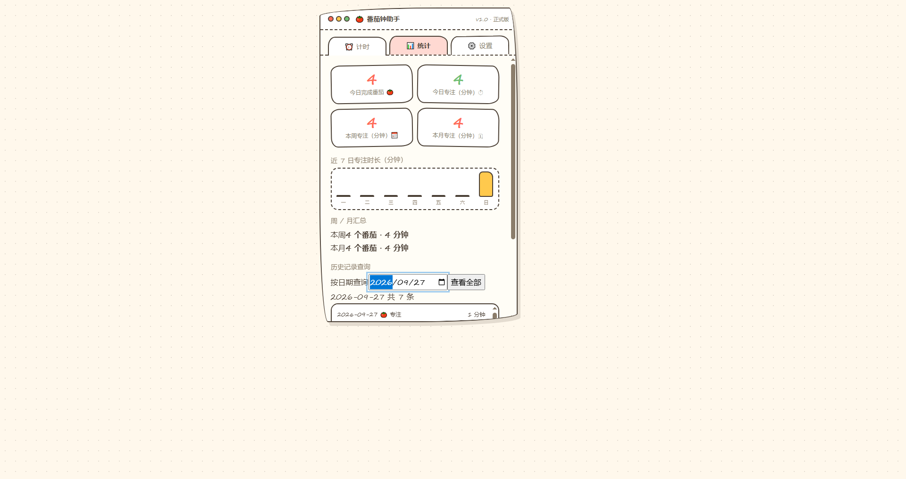

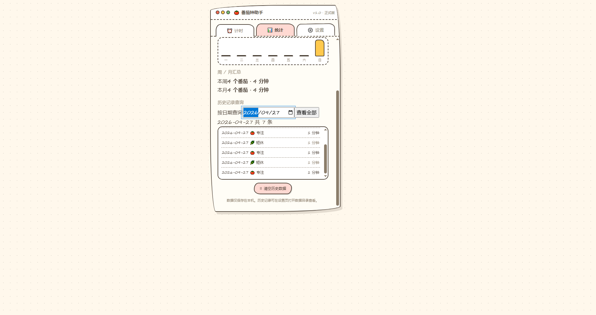

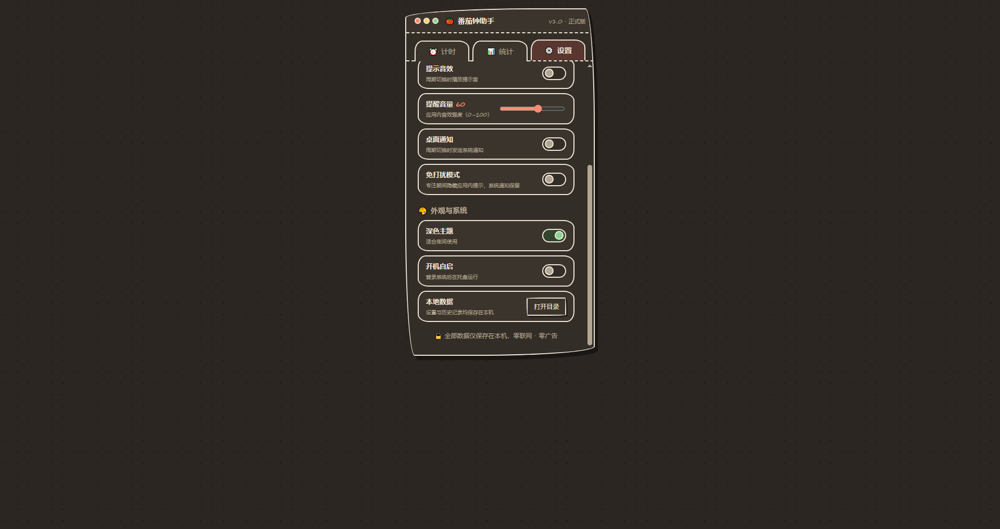

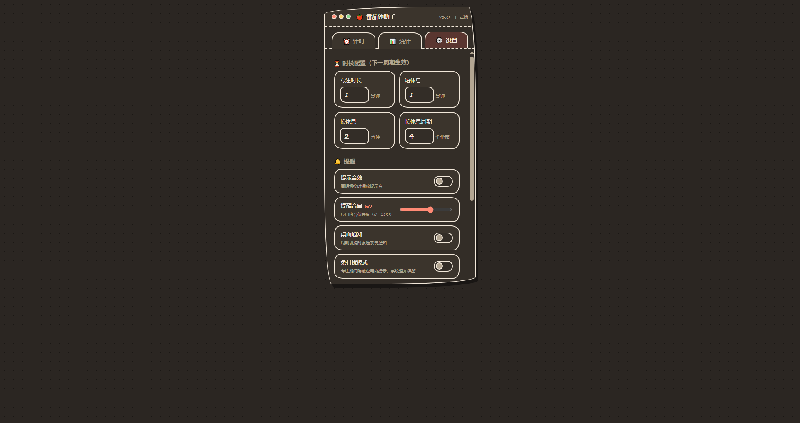

独立 UI 脚本实际操作并断言：

1. 默认时长 25/5/15 分钟；在设置中将测试时长改为 1/1/2 分钟。
2. 开始、暂停、等待、继续；暂停期间剩余时间保持不变。
3. 专注结束进入短休，4 个专注周期后进入长休。
4. 统计页、日期过滤与磁盘 `history.json` 一致：4 个完成番茄、4 分钟专注。
5. 切换深色主题，重载后主题及统计仍保留。
6. 清空历史需要二次确认，确认后统计清零。

测试使用 Playwright **渲染器虚拟时钟**缩短等待，不是现实经过 25 分钟的精度测试。未发现渲染器错误或监听到的 HTTP 请求；这不等于系统级网络审计。提示音听感、系统通知投递、重启自启和 macOS 未在本轮实测。

### 8. 在隔离副本完成验收

独立试用通过后，回到「成果验收」打开统计功能，点击「验收通过」。状态由 `acceptance` 变为 `done`，有效功能验收进度 **4/9 → 5/9**。

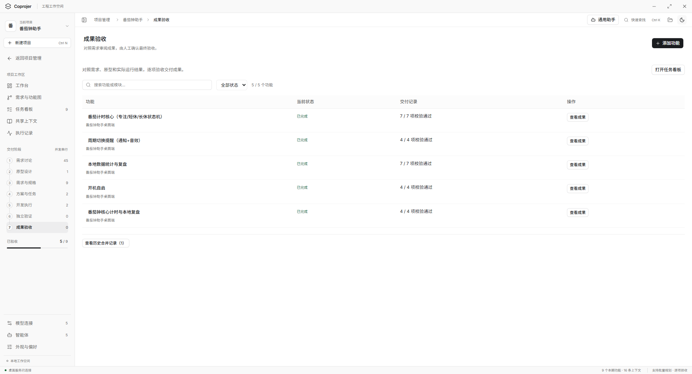

这是本轮自动化操作在**隔离副本**中的流程验收记录，不代替用户对原始项目的最终业务签收。本次没有启动下一项；批量场景的「验收通过并继续」由本轮回归覆盖。

## 测试结果与边界

### 2026-09-28 发布检查

当前全量入口为 `npm test`：先类型检查和构建，再顺序运行 46 个脚本。各功能历史验证对应各自的源码状态；本次最终检查结果、截图范围、发布内容及密钥检查见[发布验证记录](docs/verification/2026-09-28-release.md)。

9 月 28 日的番茄钟补充实测完成了验证准备与独立复验，但原生托盘鼠标/悬停及最终人工验收仍未完成。记录保留早期失败和后续结果，不以准备阶段成功覆盖实际失败，见[原生检查审计](docs/verification/2026-09-28-native-preparation-audit.md)。供应商真实调用和受控响应的验证范围详见各功能说明。

### 2026-09-27 历史案例

**2026-09-27 最终 `npm test` 退出码为 0**：包括 TypeScript、构建与 `package.json` 中 23 个串行脚本。测试会操作真实 Electron，但协议和在线推荐响应多数来自受控夹具，不能冒充所有供应商实测。

| 证据层级 | 本轮结果 |
| --- | --- |
| Coprojer 回归 | 23 脚本通过；三协议、工程、原型、圆桌、队列、技能、助手、重启与验收 |
| 布局 | 1280×840 / 860×600、明暗主题通过；教程另用最大化截图 |
| 真实模型执行 | 统计功能开发/验证完成，32 个工程测试通过，自动修复 0 轮 |
| 独立原生 UI | 计时、暂停/继续、短长休、统计、日期、主题持久化、清理二次确认通过 |
| 产品修复 | 已合并历史功能误入统计、待办与批量候选；回归先失败后通过 |
| 测试脚本修复 | 新 PRD 未渲染就确认旧文档的竞态；改为等待新文档呈现后确认 |
| 原始资料 | 原 Coprojer 主数据和原工程既有改动保持原样 |

边界与待验证项：

- 剩余番茄钟功能保留方案/就绪状态，未写成全部交付；已有清理、主题交互不等于对应功能卡已独立验收。
- 原型与真实界面未做完整视觉一致性验收；落盘抗故障、系统重启、自启、提示音与托盘行为未全部实测。
- 网络观察仅覆盖测试期间的页面 HTTP 请求；Coprojer 调模型本身需要联网。
- 文件工具有路径检查，命令以本机用户权限执行，不构成操作系统级沙箱。
- 案例来自既有私有资料，克隆仓库不会自动出现相同工作空间；本次未上传私有配置和完整聊天记录。

详见[验证报告](docs/verification/2026-09-27-pomodoro-walkthrough.md)。

## 开发与本地资料

### 命令

| 命令 | 用途 |
| --- | --- |
| `npm run dev` | 开发与热更新 |
| `npm run typecheck` | TypeScript |
| `npm run build` | 检查并构建到 out/ |
| `npm start` | 构建后启动 |
| `npm test` | 全量构建和 46 个串行脚本 |
| `npm run test:onboarding` | 新手引导与真实状态进度 |
| `npm run test:aliyun` | 快速导入、额度保护与配置隔离 |
| `npm run test:models` | 能力证据、推理设置、推荐与异常响应 |
| `npm run test:reasoning` | 推理参数和实例隔离 |
| `npm run test:traffic` | 用量采集、持久化与监控页面 |
| `npm run test:model-references` | 型号来源与证据引用 |
| `npm run test:verification` | 证据门槛、准备/复验、恢复及进程清理 |
| `npm run test:engineering` | 模型协议与工程链路 |
| `npm run test:execution-plan` | 队列、依赖和执行顺序 |
| `npm run test:research` | 讨论、原型、功能图、圆桌、决策 |
| `npm run test:novice` | 首次配置、原型优先、批量与验收续跑 |

### 资料位置

Windows 开发资料在 `%APPDATA%/Coprojer-dev/`，主数据是 `engineering-v1.json`。密钥经系统加密后保存，不返回界面；不要上传整个资料目录。工程导出 `.coprojer/FEATURES.md`、`CONTEXT.md`、`ACTIVITY.md`、`REQUIREMENTS.md`、`DISCUSSION.md` 与 `PROTOTYPES.json`，直接编辑导出文件不会反向导入。

同一资料目录只运行一个实例。验证可通过 `COPROJER_USER_DATA` 指定独立目录，并同时隔离目标工程；只换资料目录不会隔离仍指向原路径的项目。全窗口截图要求已写入 [AGENTS.md](AGENTS.md#操作流程截图重要)。

### 代码导航

```text
src/main/engineering/          协议、存储、工具与工程流程
src/shared/engineering.ts      共享类型与接口
src/preload/index.ts           桌面桥接
src/renderer/src/App.tsx       窗口与导航
src/renderer/src/engineering/  工作台、讨论、功能、模型、智能体
src/renderer/src/components/   公共组件
src/renderer/src/theme.css     设计变量
scripts/                      回归脚本
scripts/fixtures/             仅测试使用的协议与工程夹具
docs/screenshots/pomodoro/     2026-09-27 案例最大化截图
docs/ui/baseline-v1.6/         新功能布局与全窗口截图
docs/verification/            验证与截图来源记录
```

进一步阅读：[文档索引](docs/README.md)、[更新记录](CHANGELOG.md)、[工程指南](docs/ENGINEERING_GUIDE.md)、[需求工作区](docs/REQUIREMENTS_WORKSPACE.md)、[圆桌与多端](docs/ROUNDTABLE.md)、[技能与配置](docs/AGENT_SKILLS.md)、[UI 规范](docs/UI_SPEC.md)、[实施计划](docs/IMPLEMENTATION_PLAN.md)。
