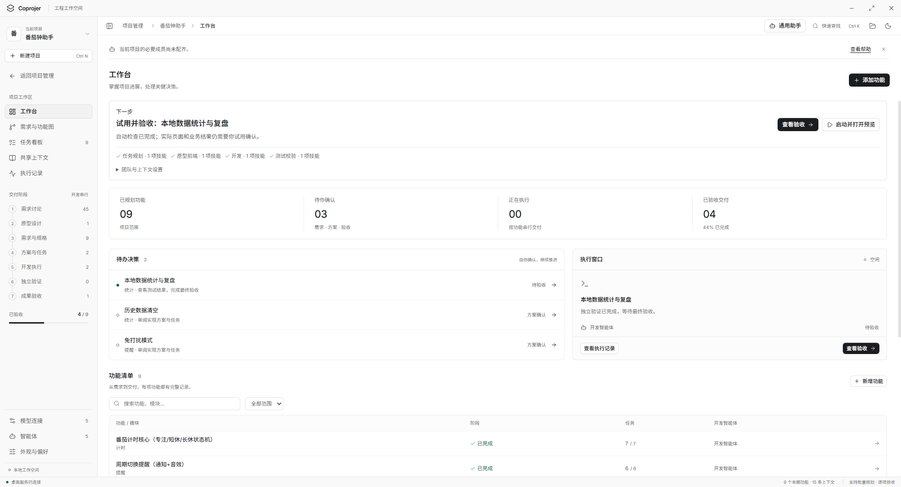

<p align="center">
  
</p>

<h1 align="center">Coprojer</h1>

<p align="center"><strong>把想法一步步做成可验证的项目。</strong></p>

<p align="center">Windows x64 · 本地工作空间 · 接入你自己的模型</p>

<p align="center">
  <a href="https://github.com/yuyanpeng0909-cmyk/coprojer/releases/latest"><strong>下载 Windows 版</strong></a>
  &nbsp;·&nbsp; <a href="#快速开始">快速开始</a>
  &nbsp;·&nbsp; <a href="docs/README.md">使用文档</a>
</p>

Coprojer 是面向个人开发者与需要工程引导的使用者的 **AI 工程工作台**。在一个本地桌面工作空间中讨论需求、试用原型、协作开发，再查看验证证据并亲自验收；项目进度、文件修改和关键决定都有记录可查。

[](docs/screenshots/pomodoro/02-workbench.png)

<p align="center"><sub>番茄钟助手项目工作台 · 点击查看原图 · <a href="examples/pomodoro/README.md">了解示例与开发流程</a></sub></p>

## 用 Coprojer 做什么

| 能力 | 你可以做什么 |
| --- | --- |
| **先把需求说清楚** | 讨论目标，通过圆桌与功能图拆解需求，保留你的决定。 |
| **先试原型，再开始开发** | 迭代交互原型，确认需求与方案后，再逐项推进开发。 |
| **按角色组织 AI 协作** | 为规划、原型、开发、验证分配模型和技能，结合共享上下文工作。 |
| **看证据，逐项验收** | 查看实际文件修改与独立验证结果，亲自试用；任务中断后可继续推进。 |

**描述目标 → 试用原型 → 确认需求与方案 → 开发与独立验证 → 亲自验收**

更多能力见[功能与验证矩阵](docs/FEATURE_CATALOG.md)，包括模型连接、技能、用量监控与长任务恢复。

## 快速开始

### 1. 安装 Coprojer

前往 [Releases](https://github.com/yuyanpeng0909-cmyk/coprojer/releases/latest)，下载 Windows x64 安装包，按向导安装。

- 当前提供 **Windows x64** 安装包；安装并打开界面无需克隆源码。
- 工程开发需要本机安装 **Node.js 22.12+**（含 npm）。
- 安装说明、签名状态与校验信息见对应发布页。

### 2. 连接模型

打开侧栏「新手入门」，配置自己的模型服务与 API Key，完成连接和开发能力检查，再为四类角色分配模型。同一个型号可以用于多个角色。

支持 Chat Completions、Responses 和 Anthropic Messages 协议，也可使用[阿里云快速导入](docs/ALIYUN_IMPORT.md)。实际调用费用由你接入的模型服务决定。

### 3. 开始你的第一个项目

选择已有项目或新建项目，描述目标，跟随引导试用原型、确认方案并推进开发。已有项目可从项目库继续。

[打开新手入门指南](docs/ONBOARDING.md) · [查看完整图文指南](docs/USER_GUIDE.md)

<details>
<summary><strong>从源码运行</strong></summary>

需要 Node.js 22.12+、npm，以及有效的模型连接。

```powershell
git clone https://github.com/yuyanpeng0909-cmyk/coprojer.git
cd coprojer
npm ci
npm run dev
```

安装依赖后，Windows 也可双击 `start-dev.cmd`。开发命令与代码导航见[开发指南](docs/DEVELOPMENT.md)。

</details>

## 示例项目

[番茄钟助手](examples/pomodoro/README.md)提供可独立运行的 Electron 应用与单元测试。结合[流程讲解](docs/examples/pomodoro.md)，对照需求、原型、代码修改、验证与验收，了解 Coprojer 如何推进一个项目。

```text
src/        Coprojer 主程序
examples/   示例项目与自身测试
scripts/    主程序回归与开发工具
docs/       使用指南、开发说明与验证记录
licenses/   第三方许可声明
```

## 文档与示例

| 想了解什么 | 从这里开始 |
| --- | --- |
| 首次配置与实际操作 | [新手入门](docs/ONBOARDING.md) · [完整图文指南](docs/USER_GUIDE.md) |
| 看一个项目如何推进 | [番茄钟流程讲解](docs/examples/pomodoro.md) · [示例代码](examples/pomodoro/README.md) |
| 模型、智能体与技能 | [模型配置](docs/USER_GUIDE.md#首次创建与模型配置) · [智能体与技能](docs/AGENT_SKILLS.md) |
| 所有能力与使用边界 | [功能与验证矩阵](docs/FEATURE_CATALOG.md) · [文档索引](docs/README.md) |
| 开发与版本变化 | [开发指南](docs/DEVELOPMENT.md) · [更新记录](CHANGELOG.md) |

## 使用前了解

- **你的确认是流程的一部分。** 独立验证通过后，仍需亲自试用和验收。
- **本地工作空间，按需连接模型。** 工程与应用资料保存在本机；模型调用需要联网，相关上下文会发送给你配置的服务。
- **留意执行权限。** 工程命令以本机用户权限运行，建议先在独立项目或副本中试用。

安装包包含 Coprojer 主程序，示例源码可从仓库获取。个人工作空间和模型凭据由使用者自行配置；测试范围与原始证据见[验证记录](docs/verification/README.md)。
