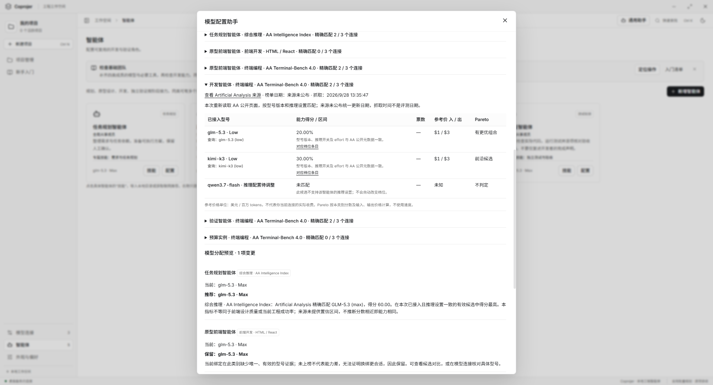

# 智能体推理设置与 AA 档位匹配

更新：2026-09-28。入口：**智能体 → 具体实例的配置 → 推理设置**。

## 配置与生效范围

模型显示名会包含当前推理设置，例如 glm-5.3 · Max、kimi-k3 · Low、qwen3.7-flash · 推理 · 最大预算。原始 API model ID 和模型连接名称保持不变。

每个智能体实例独立保存推理开关、档位或预算。共享同一模型连接的其他智能体不受影响，项目专用实例仍与全局实例隔离，Skill 所有权不变。旧数据没有推理字段时，运行时采用该型号支持的最高默认设置，不批量重写历史配置。

已有的项目讨论 / 原型单独选型入口保持原行为：若明确选择了与智能体绑定不同的型号，使用该连接的服务默认，不把另一型号的实例档位强行套过去。使用智能体自身绑定型号时才应用该实例的推理配置。

| 已核实的连接与型号 | 配置方式 | 默认 | 能否关闭 |
| --- | --- | --- | --- |
| 智谱 / Z.ai Chat：glm-5.3、glm-5.3-flash | Low / High / Max | Max | 否 |
| 百炼 Chat：glm-5.3、ZHIPU/GLM-5.3、ZHIPU/GLM-5.3-Flash、ZHIPU/GLM-5.3-FlashX、kimi-k3 | Low / High / Max | Max | 否 |
| 百炼 Chat：kimi/kimi-k3 | Max | Max | 否 |
| Moonshot Chat：kimi-k3 | Low / High / Max | Max | 否 |
| 百炼 Chat：qwen3.7-flash | 思考 Token 预算，1–262144；留空用最大预算 | 开启，最大预算 | 是 |
| 百炼 Chat / Responses：已列明的 Qwen3.8 型号 | Low / Medium / XHigh | XHigh | 是 |
| 百炼 Responses：glm-5.3 | Low / High / Max | Max | 否 |

Qwen3.8 支持列表与其他已适配 Responses 型号以 src/shared/reasoning.ts 的明确型号表为准。不同协议不复用猜测参数。未知型号、未核实的中转地址或协议显示“推理：服务默认”，暂不发送自定义推理参数；服务默认不冒充 Max。

Qwen 的最大预算不是 Max 档位，也不保证每次消耗全部预算。关闭推理后不发送档位或预算参数。始终推理的型号禁用关闭选项，后台也会拒绝非法关闭。修改型号时保留兼容设置，否则配置表单切回新型号支持的最高默认值；自动推荐不会用不兼容的候选替换当前模型。

Chat 按已核实的提供商协议发送 reasoning_effort 或 enable_thinking / thinking_budget；Responses 发送 reasoning.effort。不会把 -max、-high 拼进 API 模型 ID。原有 GLM 固定 low 已移除。执行快照保存该次实际配置，恢复检查和推荐方案指纹包含推理设置；生成推荐之后再修改档位，需要重新推荐。

## AA 查询与推荐

每次点击“一键推荐模型”重新读取 Artificial Analysis 的公开模型页，解析页面公开的 JSON 数据；不执行页面脚本，不调用未公开接口。需要额外档位数据时，仅使用公开目录内已列出的条目地址。请求不携带模型 API Key、用户提示词或连接地址，同次请求去重，不跨推荐复用旧成绩。

匹配同时核对明确映射的模型版本、是否推理、effort。GLM-5.3 (max) 与 GLM-5.3 (low) 是不同条目，High 没有对应证据时不会借用 Max。Flash 名称未写档位时，只有页面公开元数据明确标注该档位才接受。自定义思考预算没有可核实的同配置证据时保留未匹配状态，并可附带最多 3 项明确标注差异的名称近似参考；参考成绩不参与自动选型。详见[近似参考与来源打开规则](MODEL_RECOMMENDATIONS.md#未匹配时查看名称近似参考)。

| 所选能力 | 推荐证据 |
| --- | --- |
| 综合推理 | AA Intelligence Index，规划默认选项 |
| 终端编程 | AA Terminal-Bench 4.0，开发与验证默认选项；展示百分比 |
| Web / 前端 / 全栈 | 继续用 Arena 专项；AA 编程只作额外参考，不替代前端指标 |
| 原有综合问答 / 代码理解 | 可继续手动选择 Arena 对应类别 |

AA 指数、终端任务通过率与 Arena 偏好分数分开展示和选择，不合并、不捏造票数或置信区间。AA 来源未公布统一更新日期，界面区分“来源未公布”与本次抓取时间。价格为来源参考价格，不是当前连接账单。

推荐只在已接入、同推理配置且有有效证据的候选中比较。能力优先选最高分；没有置信区间的 AA 指标只在最高分并列时参考费用。当前模型无有效证据、联网失败、格式变化或匹配歧义时保留绑定。推理设置与已保存配置变化会使旧推荐失效。

图中的分数与价格来自隔离测试数据，仅演示匹配和交互，不作为真实排名。两张操作图均来自最大化完整 Electron 窗口。

## 依据与验证

参数依据：阿里云 [Chat 参数](https://help.aliyun.com/zh/model-studio/qwen-api-via-openai-chat-completions)、[Responses 参数](https://help.aliyun.com/zh/model-studio/qwen-api-via-openai-responses)、[Qwen3.7 Flash](https://www.alibabacloud.com/help/en/model-studio/qwen3-7-flash)，以及官方 [GLM-5.3](https://huggingface.co/zai-org/GLM-5.3)、[GLM-5.3-Flash](https://huggingface.co/zai-org/GLM-5.3-Flash)、[Kimi-K3](https://huggingface.co/moonshotai/Kimi-K3) 模型说明。核对日期为 2026-09-28，提供商后续修改参数需要更新适配表。

AA 读取 [公开模型目录](https://artificialanalysis.ai/models) 与其中列出的档位详情，不需要额外 AA API Key。此实现未接入另行授权的 AA Data API。

专项命令：npm run test:reasoning。脚本覆盖协议参数、模型 ID 不变、默认最高值、开关约束、实例与 Skill 隔离、持久化、同型号不同档位不混分、每次重新获取、离线保留和失效方案拒绝。Electron 使用隔离资料目录与受控请求，覆盖 1280 × 840 / 860 × 600 亮色、暗色；不会调用用户的付费模型。

真实 AA 公开页读取验证与受控推理调用测试分开：前者确认页面结构和条目元数据可读，后者确认本地请求参数及工作流。两者都不宣称已验证用户账户上的真实推理质量或配额。

2026-09-28 完成记录：完整 npm test 通过（.runtime/reasoning-regression.log）。最后补充型号切换提示、可访问标签、显式项目选型边界与有效推理设置的检查点指纹后，npm run test:models 和 scripts/execution-budget.cjs 复测通过（.runtime/reasoning-final.log、.runtime/reasoning-checkpoints.log）；13 张隔离 Electron 截图记录在 output/playwright/reasoning/result.json。真实 AA 公开页面只读解析结果保存在 .runtime/reasoning-aa-live.json，核对了 Max / Low 与 Flash 元数据，没有发送模型推理请求。

运行中的应用已正常关闭并以最新编译结果重新启动。重启前确认没有执行任务、预览或助手响应；重启后模型、智能体、Skill、项目、助手会话、默认值及其他保存区块的哈希全部一致。核对记录为 .runtime/reasoning-restart-hashes.json；没有强制终止应用，没有提交或推送代码。
