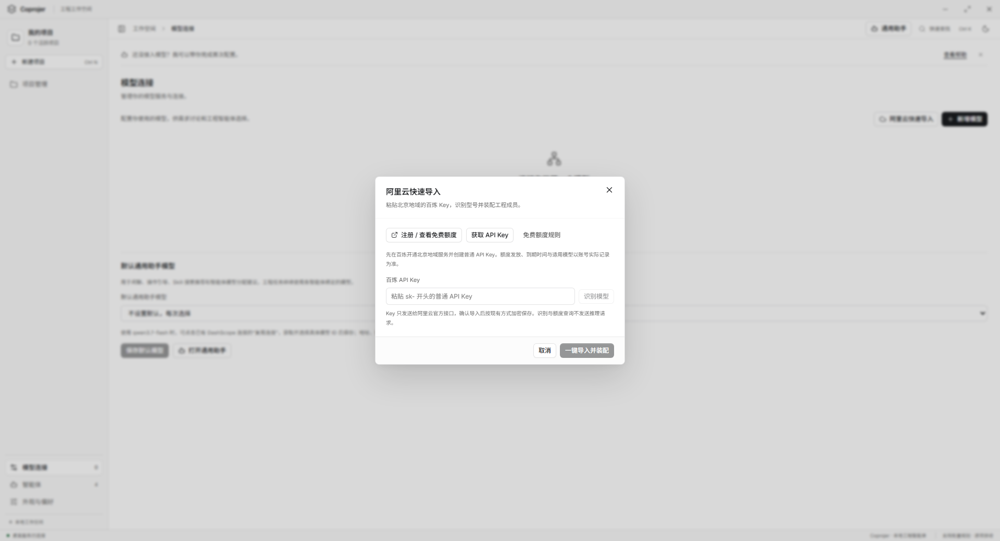
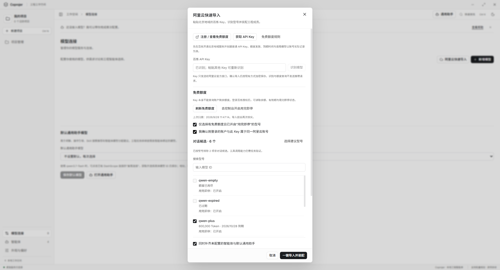
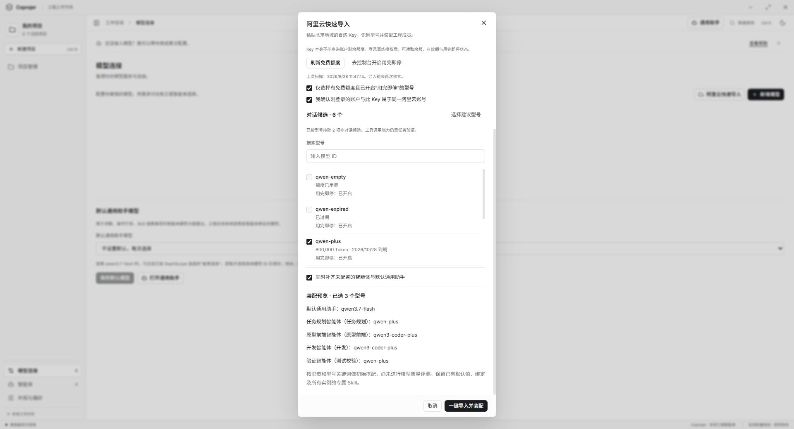

# 阿里云百炼快速导入

更新日期：2026-09-28。入口为「模型连接 → 阿里云快速导入」，沿用 UI 1.6 和现有本机配置存储。

粘贴北京地域的普通 API Key 可以识别对话候选型号；要扫描账户的真实免费额度，还需要在浏览器中完成一次百炼控制台授权。模型列表中的型号不等于该账户仍有免费额度。

## 1. 注册并获取 Key

点击「注册 / 查看免费额度」打开[百炼北京地域免费额度页面](https://bailian.console.aliyun.com/cn-beijing/costing-balance/free-quota)。按页面提示注册、开通服务，然后通过「获取 API Key」创建普通 Key。免费额度是否发放、有效期和适用型号以该账户的实际记录及[官方规则](https://help.aliyun.com/zh/model-studio/new-free-quota)为准；本应用不替用户注册或领取额度。

将 Key 粘贴到密码输入框，点击「识别模型」。只读取官方模型列表，不发送推理请求。订阅套餐 Key（sk-sp-）及其他地域不适用于本流程。识别成功后输入框清空，Key 暂存于主进程导入会话；粘贴新 Key 会废弃旧预览。

以下操作图均由最大化的真实 Electron 窗口捕获，使用隔离资料与受控服务响应；型号、额度和项目状态用于演示流程，不代表真实账户余额或供应商当前型号目录。

## 2. 登录并扫描免费额度

点击「登录并扫描免费额度」，在默认浏览器的阿里云官方页面完成授权，然后返回 Coprojer。应用读取候选型号的剩余 Token、到期时间和「用完即停」状态。若登录取消、超时或返回格式不受支持，会明确报错，不把未知额度视为可用。

免费模式默认开启，只有同时满足以下条件的型号可以选中：

- 官方返回状态为有效。
- 剩余 Token 大于 0，且有效期尚未结束。
- 已开启「免费额度用完即停」。

未开启用完即停时，可点击「去控制台开启用完即停」，在官方页面为目标型号开启，等待设置生效后回到应用「刷新免费额度」。应用只读取此开关，不替用户修改云端计费设置。已认证用户若未开启该保护，额度耗尽后可能转为按量付费；云端设置存在生效延迟，后续费用及可用性仍受阿里云账户状态影响。

勾选「我确认刚登录的账户与此 Key 属于同一阿里云账号」。当前查询接口无法可靠比对两者归属；请不要用账户 A 的授权余额导入账户 B 的 Key。切换账户时关闭导入面板并重新识别、授权。

## 3. 预览并一键装配

系统从实际扫描的候选中选择建议型号，也可搜索并调整勾选，每次最多导入 100 个不同型号。装配预览展示默认通用助手与未配置的全局智能体将使用的具体模型 ID。初始搭配按职责及型号关键词生成，不代表模型质量或工具调用能力已经评测。

点击「一键导入并装配」时，免费模式会再次查询所选型号，拒绝已耗尽、过期或保护状态不明的选择。导入后模型连接直接显示供应商的原始模型 ID，无需另外命名。

默认同时补齐尚未配置的全局智能体和默认通用助手；已有绑定、默认值、项目专用智能体、项目显式模型选择和所有实例的专属 Skill 均保留。有工程任务运行时，不执行自动装配，可以取消「同时补齐」仅导入连接。已有绑定需要调整时，使用原有模型配置助手审阅后应用。

如果只需要普通快速导入，可以取消「仅选择有免费额度且已开启用完即停的型号」。此时无需控制台授权，也不核实额度或保证后续调用免费；界面会显示收费边界。识别、额度扫描和装配本身均不发起模型推理，后续聊天和工程执行才调用模型。

## 配置、凭据与兼容范围

- 仅确认导入后，沿用 EngineeringStore、Electron safeStorage 和 engineering-v1.json 保存加密 Key；不迁移或清空旧资料。
- 同型号、地址、协议及 Key 才复用现有连接，不合并不同账户的同名型号。保存失败回滚内存配置。
- 控制台授权凭据只保存在主进程导入会话，不传给渲染页面、不落盘。预览有效期为 15 分钟，关闭面板或退出应用会清理会话并取消等待中的授权。
- 当前支持中国站北京地域直接账户和普通 DashScope Key。暂不处理国际站、代理切换账户、订阅套餐或非对话模型；这些场景保留原有手动配置入口。
- 不自动创建云端 Key，不修改云端用完即停设置，不安装百炼 CLI。

## 接口依据与验证边界

官方依据于 2026-09-28 核对：

- [阿里云新人免费额度与用完即停规则](https://help.aliyun.com/zh/model-studio/new-free-quota)。
- [官方 Model Studio CLI](https://github.com/modelstudioai/cli)，免费额度命令使用 Console 身份，而模型请求使用 API Key。
- [免费额度查询命令](https://github.com/modelstudioai/cli/blob/main/packages/commands/src/commands/usage/free.ts)、[Console 登录](https://github.com/modelstudioai/cli/blob/main/packages/commands/src/commands/auth/login-console.ts)、[Console gateway](https://github.com/modelstudioai/cli/blob/main/packages/core/src/console/gateway.ts)。

实现使用官方 CLI 公开的只读控制台调用方式。该协议未来可能变化；无法解析、未返回额度或状态不明时，免费模式拒绝导入，不退回猜测额度。

运行 npm run test:aliyun 可构建并检查本功能；两个检查也已纳入 npm test：

- scripts/aliyun-import.cjs：模型过滤、授权回调及来源/state 检查、取消、额度响应格式、有效期及余额、用完即停、导入前重查、保存失败回滚、凭据加密、账户隔离、现有绑定与 Skill 保留、零推理调用。
- scripts/aliyun-import-smoke.cjs：隔离资料中的真实 Electron 点击流程、注册入口、预览/装配、重复导入、更换 Key、取消授权、重启恢复，以及 1280 × 840 / 860 × 600 和暗色布局。固定尺寸图仅用于布局回归，教程图先最大化窗口再捕获。

2026-09-28 已通过构建、完整 npm test 和修正截图同步后的导入专项 Electron 检查；设计检测未发现本次界面的机械规则问题。测试使用受控网络服务和测试凭据，没有使用用户真实 Key，因此不能据此声称真实阿里云账户的注册、授权、额度查询或模型调用已经端到端通过。回归证据保存在 output/playwright/aliyun-import/evidence.json，截图实际尺寸与最大化状态记录在同目录 screenshots.json；该目录的隔离资料不应发布为用户配置。
