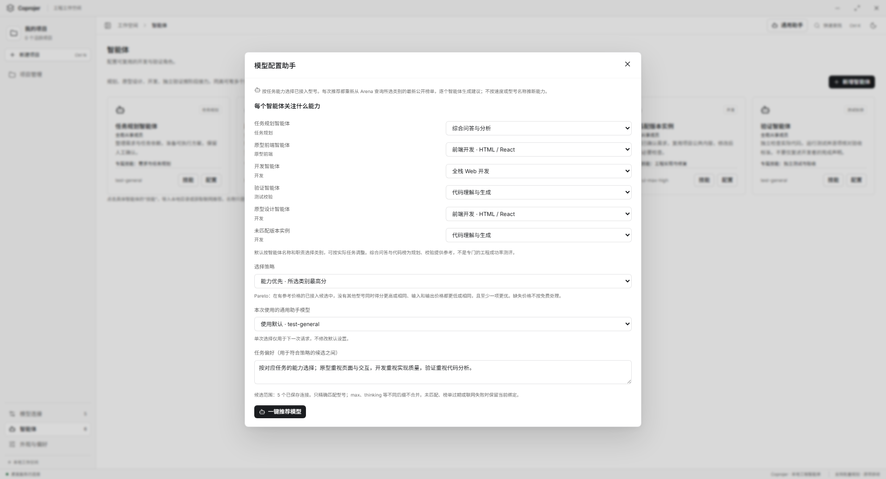
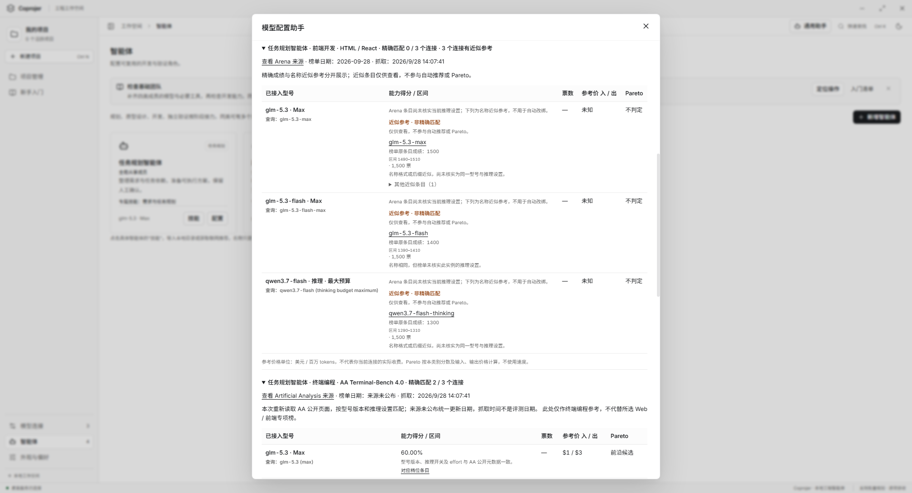
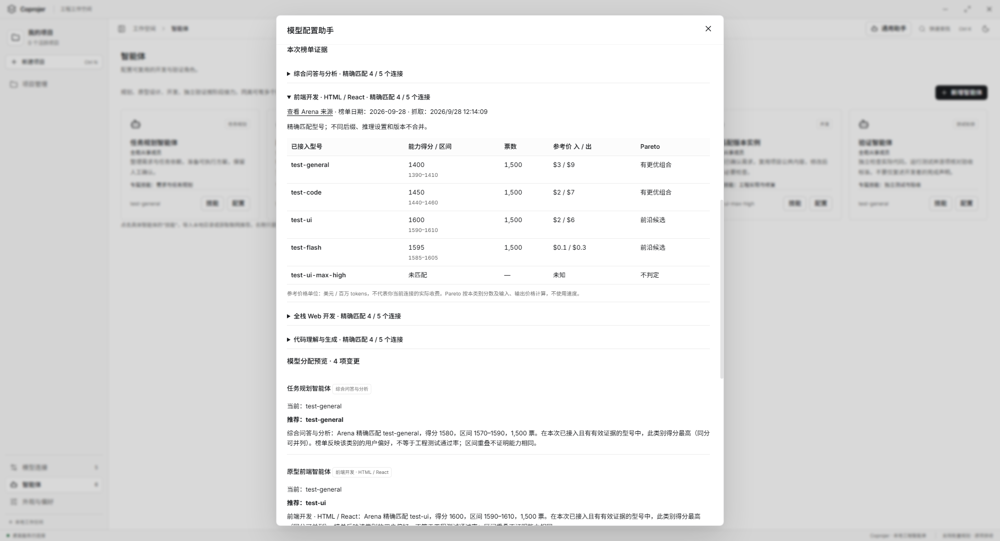
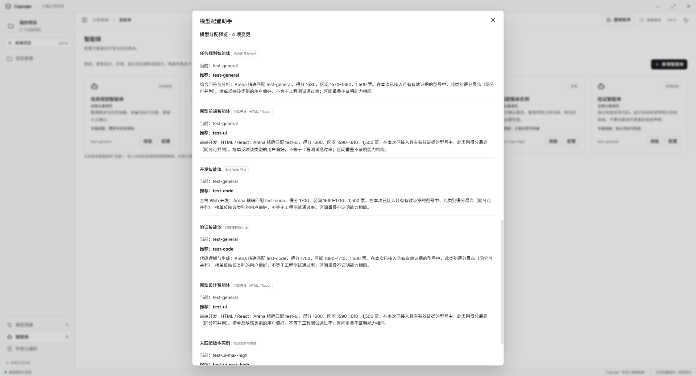
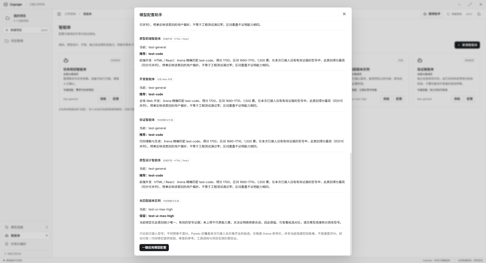

# 按能力榜单为智能体推荐模型

更新：2026-09-28。入口：智能体 → 模型配置助手。

本日新增实例独立的推理强度和 AA 查询。默认综合 / 编程指标调整为 AA Intelligence Index / Terminal-Bench 4.0，Arena Web / 前端专项保留；当前行为与参数范围详见[智能体推理设置与 AA 档位匹配](AGENT_REASONING.md)。以下 Arena 专项说明仍适用于手动选择的原有类别，旧验证记录保留各自的验证边界。

最新验证：本次推理配置版本的完整 npm test 已通过，最终 npm run test:models 与执行检查点专项也通过。文末“完整测试未全绿”属于推理配置版本之前的历史记录；本次结果与日志见上述新说明。

## 选择能力与策略

每个智能体实例有独立的本次能力类别选择。原型、前端适合 Frontend；端到端 Web 任务可选 Fullstack；开发与校验默认参考 AA 终端编程，规划默认参考 AA 综合指数，也可选原有 Arena Coding / Text。类别是推荐依据，不改动智能体职责、指令或专属 Skill。

能力优先使用所选类别最高分的已接入有效候选，同分可以并列。Pareto 策略允许在与最高分候选的分数区间重叠的型号中参考费用。区间重叠不证明能力相等；不将不同类别的分数相加，也不以响应速度替代能力。

以下操作图来自最大化的完整 Electron 窗口。test-* 型号、分数、价格和模型回执是隔离验证数据，用于演示交互，不是真实排名或用户账户配置。

## 每次重新查询，展示证据

每次点击推荐都会重新请求所选类别的固定公开页面；网络请求禁用缓存，不读取上次方案作为新证据。一次推荐内相同类别只查一次，所有全局实例分别收到结果。页面发布更新可能慢于当前时间，因此分别显示“榜单日期”和“抓取时间”，不把今天抓取写成今天发布。

| 能力类别 | 公开来源 |
| --- | --- |
| Web 开发综合 | [Arena WebDev Overall](https://arena.ai/leaderboard/code) |
| 前端 HTML / React | [Arena WebDev Frontend](https://arena.ai/leaderboard/code/webdev/frontend) |
| 全栈 Web 开发 | [Arena WebDev Fullstack](https://arena.ai/leaderboard/code/webdev/fullstack) |
| 代码理解与生成 | [Arena Text Coding](https://arena.ai/leaderboard/text/coding) |
| 综合问答与分析 | [Arena Text Overall](https://arena.ai/leaderboard/text) |

读取公开服务端表格，不执行页面脚本，不访问登录数据。结构、类别、日期或完整性校验失败时，明确标注本类别获取失败；不会改用语言模型记忆中的排名。来源日期超过 30 天或异常时仅供查看，本次不用于自动改绑。

只按模型 ID 精确匹配（忽略大小写与首尾空格），不删改版本、推理等级、供应商前缀、Max / Thinking / Harness 后缀。出现同名多项时视为歧义，不擅自选高分项。当前绑定未匹配到有效证据时保留，因为缺少数据无法证明其它型号更适合。

### 未匹配时查看名称近似参考

没有精确成绩时，从本次新抓取的同一榜单中寻找最多 3 个名称相近的条目。仅在同一名称家族中比较，容忍名称分隔符、供应商前缀、推理后缀或接近的版本数字；这些变化只用于发现参考条目，不证明模型相同。按名称相近程度排列，默认显示最接近的一项，其余折叠在“其他近似条目”。

界面显示“近似参考 · 非精确匹配”、榜单原名、原条目成绩和具体差异。版本 / 规格数字不同会单独提醒；推理档位、开关或预算无法核实一致时明确说明。AA 参考保留原指标与推理配置，不与 Arena 分数混算。未找到足够接近的条目或来源出现冲突时仍显示未匹配 / 冲突，不随意填入高分模型。

近似成绩与精确成绩分开存放，仅供人工查看，不参与自动推荐、自动改绑或 Pareto；已有的“证据不足时保留当前绑定”规则继续有效。每次推荐重新抓取公开页面，不沿用之前的搜索快照。AA 近似详情只访问当前公开目录中实际列出的链接，不猜测 URL。

“查看 Arena 来源”“查看 Artificial Analysis 来源”和具体条目名称通过系统浏览器打开。应用主窗口不跳转；打开失败时在原链接旁显示提示与可复制的地址。后台仅允许固定榜单地址与 AA 公开模型详情地址，不接受任意协议或域名。

此图来自最大化的完整 Electron 窗口。分数、型号组合和价格是隔离测试数据，仅演示警示、折叠和来源交互，不作为真实模型排名。专项命令为 npm run test:model-references；验证包括近似候选上限、不同版本与预算、精确 / 近似隔离、每次重新抓取、来源链接交给系统浏览器、打开失败提示、键盘重试，以及 1280 × 840 / 860 × 600 的亮色与暗色布局。

2026-09-28 近似参考与来源修复验证：npm run test:models 全部通过，包含构建、新增近似匹配 / 来源交互、推理设置、专属 Skill、推荐应用与异常结果防白屏。日志为 .runtime/model-evidence-reference-models.log。真实 AA / Arena 公开页面只读获取也通过，结果为 .runtime/model-evidence-reference-live.json；未调用用户的付费模型。

本次完整 npm test 未全绿：首先在智能体配置冒烟的应用按钮等待处超时，该脚本单独复测通过；续跑后在 scripts/engineering-smoke.cjs:423 的失败修复场景等待 project idle 超时，后续脚本未继续，不记为通过。保留 .runtime/model-evidence-reference-regression.log、.runtime/model-evidence-reference-agent-check.log 和 .runtime/model-evidence-reference-remaining.log，未扩大本次修改去调整工程执行逻辑。

正式主应用在确认无任务 / 预览 / 助手响应后正常关闭并重新启动，重启前后所有保存区块哈希一致，5 个模型连接、5 个智能体和 1 个项目保留。核对记录为 .runtime/model-evidence-reference-restart.json；未中断其他隔离资料目录中的工作，未提交或推送代码。

Pareto 使用同一类别的得分（越高越好）、输入与输出参考价格（越低越好）。仅在已接入、非初步结果、有投票且价格齐全的型号中计算；没有价格的型号不标为免费或 Pareto 最优。参考价单位为美元 / 百万 tokens，不代表本机连接的实际计费。

## 预览与确认

建议模型沿用现有默认值与单次切换。后端约束可选连接 ID；模型不能返回未接入型号，也不能绕过能力 / Pareto 条件。展示的得分理由由证据生成，不将模型自由文本当成排名。

只有点击“一键应用模型配置”才保存模型变更。没有变更时按钮禁用；配置变化、方案超过 15 分钟或有工程正在运行时不应用。全局实例之外的项目专属实例不改动，角色与专属 Skill 保留，保存失败回滚。

## 验证范围

- npm run test:models：构建、榜单解析与策略测试、隔离 Electron 推荐 / 应用流程，以及旧版 / 不完整结果的白屏回归。
- node scripts/model-evidence.cjs --live：只读连接五类真实 Arena 页面，检查当前解析与精确匹配；摘要保存至 .runtime/model-evidence-live.json，不发模型推理请求。
- 受控测试验证第二次推荐读取网站变更、每次发送 no-store / no-cache、离线不复用旧方案、不泄露模型密钥、别名 / 不同版本不混配、非法选择拒绝、默认 / 单次路由、保存与重启、Skill / 项目实例隔离。
- Electron 布局覆盖 1280 × 840 与 860 × 600 的亮色 / 暗色；正式操作图为最大化全窗口。截图不能证明真实模型的执行质量或账号可用性。

## 开发更新后的推荐恢复

开发模式的界面热更新可能先于后台进程更新。旧后台返回的推荐缺少新版榜单证据时，界面会提示“模型推荐结果不完整”，不会渲染或应用该方案；请保存工作，退出并重新启动应用后重试。推荐结果中的候选、得分和模型回执也会在进入渲染状态前校验，异常保留在弹窗内，不清空整个工作台。此过程不修改已保存的模型绑定、Skill 或用户工程。

回归脚本 scripts/model-assistant-contract-smoke.cjs 通过真实 Electron IPC 注入旧版方案、空结果、错误选择数组、缺少候选 / 票数 / 回执等结果，验证错误提示、重试、关闭重开及明暗双尺寸布局；不使用用户资料或付费模型。

2026-09-28 白屏修复验证：修复前注入旧格式方案，复现 Cannot read properties of undefined (reading 'map')，工作台正文为空；修复后同一脚本与 npm run test:models 全部通过。覆盖构建、正常推荐与应用、6 类异常响应及双尺寸明暗布局，日志为 .runtime/model-assistant-white-screen.log。本次未重跑完整 npm test。

2026-09-28 验证记录：最终 npm run test:models 通过（含构建、策略、配置隔离与 Electron 交互）；五类真实公开页面只读抓取通过，服务端表格日期为 2026-09-25，抓取时间单独记录。完整 npm test 未全绿，在 scripts/execution-budget.cjs:124 的修复轮数断言停止（预期 3、实际 0），不属于本次修改的模型推荐路径；之后的全量脚本未据此宣称通过。完整日志为 .runtime/model-assistant-regression.log，本次最终专项日志为 .runtime/model-assistant-final.log。
