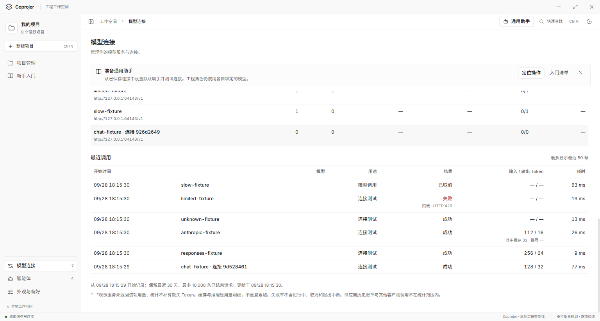

# 模型流量监控

在左侧「模型连接」打开「流量监控」。所有已保存的模型连接自动记录用量，无须逐个设置；之后新接入的模型使用相同规则。

模型采集在主进程运行，关闭监控页面仍会记录。页面打开时每 5 秒刷新，也可手动刷新。已在运行的旧版本需要在当前工程任务结束后重启应用，才会载入新增采集逻辑；不会补算此前的历史调用。

## 查看方式

- 时间范围：今天、最近 24 小时、最近 7 天、最近 30 天。「今天」按本机时区零点计算，其余为滚动时间范围。
- 模型连接：默认全部已接入连接，也可筛选一个连接；点击按模型统计中的名称可直接筛选。相同型号的不同连接按连接 ID 独立统计，同名连接附短 ID，避免相同地址的连接难以区分。
- 总览：请求数、当前进行中、近一分钟请求数、已报告 Token、失败率、成功请求平均耗时。
- 请求趋势：今天和 24 小时按小时分桶，7 天和 30 天按 24 小时分桶；灰色为全部请求，红色为失败请求。
- 按模型统计：请求、失败、输入/输出 Token、返回用量的请求数、成功请求平均耗时。
- 最近调用：开始时间、请求型号、用途、成功/失败/取消/中断状态、输入/输出 Token、耗时；最多显示 50 条。汇总不受这 50 条展示限制。

### 界面示例

以下为隔离资料目录、本机模拟服务产生的真实 Electron 截图，使用最大化完整窗口。截图中的 7 个连接、6 次调用、608 Token 都是测试数据，不是用户实际用量或供应商账单。

打开「模型连接 → 流量监控」，查看请求、用量、失败率和趋势，再按时间或连接筛选：

向下滚动查看每个连接和最近调用；同型号连接独立计数，未报告用量显示「—」，限流失败和取消单独标记：

## 统计口径

| 指标 | 含义 |
| --- | --- |
| 请求数 | 本应用发起的推理请求次数，包括连接测试、助手、需求讨论和工程智能体各轮调用；一次任务可能产生多次请求。按开始时间进入筛选范围。 |
| 不计入 | 拉取模型列表、未保存连接的试填请求，以及本地校验阶段就拒绝的请求。 |
| 进行中 | 所选连接当前仍在执行的请求，不受时间范围限制。 |
| 近一分钟 | 所选连接过去 60 秒内发起的请求数，不是服务商配额或剩余次数。 |
| 失败率 | 失败 ÷（成功 + 失败）；取消、退出中断、进行中不进入分母。没有已结束的成功/失败请求时显示「—」。 |
| 平均耗时 | 仅成功请求，从发起网络请求到完成响应解析的时间；小于一秒以毫秒显示。 |
| Token | 只使用接口实际返回的用量。缺失显示「—」，明确返回零则显示 0。汇总可能是部分已报告用量，覆盖数量与请求数一起显示。 |

OpenAI 兼容 Chat、Responses、Anthropic 的 JSON 和 SSE 流式响应均支持采集。Chat 流式请求带有 `stream_options.include_usage: true`；服务未报告用量时保留未知。流式累计用量覆盖旧值，不逐次相加。Anthropic 输入包含服务报告的普通输入、缓存创建及缓存读取；Chat/Responses 的缓存明细和推理明细不额外累加到总量。取消或断流前已报告的用量会保留，但不代表最终账单。

监控仅覆盖启用后经过本机 Coprojer 的调用。供应商历史账单、其他客户端调用、账户剩余额度、费用和账单结算不在本地统计范围内。

## 保存与隐私

记录保存在当前应用资料目录中的 `model-traffic-v1.json`，与工程状态分开保存。默认开发资料目录为 `%APPDATA%/Coprojer-dev`；隔离测试遵循 `COPROJER_USER_DATA`。

- 最多保留最近 30 天、10000 条已结束请求；尚在执行的请求另外保留。达到条数上限且影响所选时间段时，界面显示汇总可能不完整。
- 不记录 API Key、请求正文、对话正文、原始响应或原始错误信息。错误只保留类别和 HTTP 状态码。
- 应用退出时仍在运行的记录，重启后显示「退出中断」。不推测退出时间和耗时。
- 写盘失败不影响模型调用，界面提示尚未保存；损坏的历史文件原样保留，本次使用内存记录并明确提示。

## 实现与验证

- `src/main/engineering/model.ts`：统一推理入口和请求生命周期。
- `src/main/engineering/stream.ts`：累计用量事件采集。
- `src/main/engineering/model-traffic.ts`：本地保存、恢复、保留策略和聚合。
- `src/shared/model-traffic.ts`：协议用量归一化及查询契约。
- `src/renderer/src/engineering/ModelTraffic.tsx`：监控页面、筛选和刷新。

专项检查：`npm run test:traffic`。基础回归：`npm test`。两个监控检查脚本均已加入基础回归。

`scripts/model-traffic.cjs` 验证三种协议的 JSON/SSE、累计 Token 去重、未知/零用量、HTTP/网络错误、取消/超时、并发、重启恢复、筛选、保留期限、文件异常和隐私边界。`scripts/model-traffic-smoke.cjs` 使用隔离资料目录与本机模拟服务检查真实 Electron 交互、双尺寸、双主题、键盘导航及保存恢复。模拟服务测试不代表真实供应商可用性或计费准确性。

测试窗口通过 `scripts/test-display.cjs` 在首次显示前路由到 Windows 1 号非主屏幕；无法可靠匹配时回退主屏幕。布局基线使用 1280 × 840 和 860 × 600 CSS 视口，操作说明使用最大化完整窗口。

本轮结果、覆盖范围和生效条件见[验证记录](verification/2026-09-28-model-traffic.md)。
