# Coprojer UI 规范

**版本：1.6 · 状态：已定稿 · 生效日期：2026-09-12**

本规范固化 Coprojer 专用工程工作台。保留 1.0 的中性色、字体与紧凑密度，采用单一侧栏、独立需求探索空间和以功能交付为中心的信息结构。具体参数以本项目的设计变量和公共组件为准。

## 1. 固定的默认风格

| 项目           | 基准                                             |
| -------------- | ------------------------------------------------ |
| 主题           | 亮色 `light`                                     |
| 强调色         | 黑白 `neutral`                                   |
| 密度           | 紧凑 `compact`                                   |
| 基础圆角       | 6px                                              |
| 字体           | Inter Variable + Noto Sans SC Variable           |
| 普通正文       | 12–13px                                          |
| 工作台页面标题 | 16px                                             |
| 布局           | 单一项目侧栏、面包屑工具栏、紧凑列表、并排详情、独立滚动 |
| 质感来源       | 准确对齐、明确字重层级、轻边界、轻阴影和一致反馈 |

新功能沿用这些默认值，不自行引入新的主配色、字体或页面缩放。现有暗色主题和外观选项继续可用，用户主动选择的主题、圆角和密度继续保存；定稿不会把每次启动都强制重置为默认值。

## 2. 颜色与表面

所有界面颜色优先使用 [theme.css](../src/renderer/src/theme.css) 的变量。下表中的八位十六进制色值末两位表示透明度，叠加在实际表面上使用，不替换成不透明灰色。

### 2.1 亮色基准

| 用途                     | CSS 变量          | 值          |
| ------------------------ | ----------------- | ----------- |
| 工作区画布               | `--canvas`        | `#ffffff`   |
| 卡片、输入框、弹窗       | `--surface`       | `#ffffff`   |
| 侧栏、桌面工具栏         | `--sidebar`       | `#f9f9f9`   |
| 详情面板、表头、弹窗底栏 | `--panel-tint`    | `#fcfcfc`   |
| 主要文字                 | `--text`          | `#1a1c1f`   |
| 次级文字                 | `--secondary`     | `#5d5d5d`   |
| 辅助文字                 | `--muted`         | `#6e6e6e`   |
| 占位文字                 | `--placeholder`   | `#767676`   |
| 结构边界                 | `--border`        | `#1a1c1f14` |
| 列表细线                 | `--border-subtle` | `#1a1c1f0b` |
| 输入框和按钮边界         | `--border-strong` | `#1a1c1f1f` |
| 悬停背景                 | `--hover`         | `#1a1c1f08` |
| 列表选中背景             | `--selected`      | `#1a1c1f0d` |
| 主按钮、选中标记         | `--accent-solid`  | `#1a1c1f`   |
| 弱强调背景               | `--accent-soft`   | `#f3f3f3`   |
| 强调文字                 | `--accent-ink`    | `#1a1c1f`   |
| 主按钮文字               | `--on-accent`     | `#ffffff`   |

画布和普通卡片不需要明显色差。侧栏通过浅灰背景分区，详情通过微灰表面分区；只有浮层和可操作控件需要明显高于画布的层级。不要给每一层容器同时加背景、边框和阴影。

聊天气泡使用专用表面变量：AI 为 `--chat-assistant-surface`（亮色 `#f5f5f5`、暗色 `#282c32`），用户为 `--chat-user-surface`（亮色 `#e7f2eb`、暗色 `#263d33`），折叠详情为 `--chat-detail-surface`（亮色 `#eeeeee`、暗色 `#22262b`）。淡绿仅区分消息发送者，不改变全局强调色。

### 2.2 状态色

| 语义         | 变量                     | 亮色值    |
| ------------ | ------------------------ | --------- |
| 成功、完成   | `--tone-green`           | `#166534` |
| 进行中、信息 | `--tone-blue`            | `#1d4ed8` |
| 待确认、提醒 | `--tone-orange`          | `#92400e` |
| 错误、危险   | `--tone-red` / `--error` | `#b91c1c` |
| 辅助分类     | `--tone-purple`          | `#6d28d9` |
| 辅助分类     | `--tone-pink`            | `#9d174d` |

项目状态保留文字，配 12px 小图标：计划中为圆环、进行中为圆点环、待确认为时钟、已完成为带勾圆环。颜色集中在图标上，状态文字使用次级文字色，背景透明。

普通彩色标签背景使用语义色与表面色混合，语义色占 7%；头像背景占 5%，名字使用次级文字色。状态不能只靠颜色识别。装饰插图和用户资源可有自己的颜色，不作为应用主配色。

### 2.3 暗色兼容

暗色复用相同变量、组件、尺寸和布局，由 `data-theme="dark"` 切换，禁止在业务页面中另写一套硬编码颜色。

| 用途                       | 暗色值                            |
| -------------------------- | --------------------------------- |
| 画布 / 侧栏 / 表面         | `#1e2024` / `#181a1e` / `#23262b` |
| 详情面板                   | `#202327`                         |
| 主文字 / 次文字 / 辅助文字 | `#e3e6eb` / `#c3c8d1` / `#9da5b2` |
| 结构边界 / 较强边界        | `#34383f` / `#4c525e`             |
| 中性主按钮 / 按钮文字      | `#f4f4f5` / `#18181b`             |

其余暗色状态、阴影和可选强调色的准确值见 `theme.css`。新增组件必须在两种主题中可读，默认视觉验收以亮色、黑白强调色为准。

## 3. 字体与文字层级

字体栈固定为 `'Inter Variable', 'Noto Sans SC Variable', 'Microsoft YaHei UI', sans-serif`，使用本地字体文件。正文行高 1.5；说明和阅读内容可用 1.6–1.85。中文默认字距为 0，不对正文加大字间距。

| 场景                         | 字号 | 字重          |
| ---------------------------- | ---- | ------------- |
| 普通正文                     | 13px | 400           |
| 表单、常规列表内容           | 12px | 400           |
| 项目名称                     | 12px | 450           |
| 侧栏导航                     | 12px | 400；选中 500 |
| 顶部工作区标签               | 11px | 400；选中 500 |
| 标准按钮                     | 12px | 500           |
| 小按钮                       | 11px | 500           |
| 工作台页面标题 标准页面标题 | 16px | 550           |
| 普通分区标题 `SectionTitle`  | 13px | 500           |
| 详情面板标题                 | 14px | 550           |
| 弹窗标题                     | 15px | 550           |
| 描述、时间和辅助文字         | 11px | 400           |
| 编号、状态栏和低优先级元信息 | 10px | 400           |

使用字号和字重共同组织信息，避免整页加粗。10px 只用于短元信息，不用于正文或主要操作。数字列和统计值采用等宽数字 `font-variant-numeric: tabular-nums`。

工作台指标数字为 22px / 450，首次创建项目的欢迎标题为 20px / 550；它们不作为普通页面标题尺寸。

## 4. 桌面布局与间距

以下尺寸均为 CSS 像素。不要通过整体缩放页面改变密度。

| 部位                          | 尺寸                                |
| ----------------------------- | ----------------------------------- |
| 默认窗口 / 最小窗口           | 1280 × 840 / 860 × 600              |
| 侧栏宽度                      | 208px；窄窗口 184px，折叠 56px                       |
| 标题栏 / 工具栏 / 状态栏高度  | 36px / 39px / 22px                  |
| 侧栏导航行 / 顶部标签高度     | 30px / 28px                         |
| 工作台页面外边距              | 上 21px，左右 24px；窄窗口左右 18px         |
| 页面标题与后续区域间距        | 14px                                |
| 紧凑卡片内边距                | 12px                                |
| 表格紧凑行内边距              | 上下 7px                            |
| 功能清单行最小高度            | 46px                                |
| 详情正文内边距                | 上 18px，左右 18px，下 20px         |
| 同组按钮间距 / 图标与文字间距 | 6px / 通常 6–8px                    |
| 并排表单列间距                | 12px                                |

标题、说明、表头和列表内容保持同一左对齐基线。数字列右对齐，统计区等宽分组。仅在含义改变时增加空白或分隔线，避免同一个分组内叠加多条横线。

标题栏、工具栏和状态栏保持固定。首页正文独立滚动；需求对话与功能图分别滚动；长表单在内容区域内滚动。窄窗口优先隐藏次要列，保留名称、状态和操作入口。侧栏在窄窗口缩至 184px，可折叠为 56px；功能列表保留名称、阶段、任务和开发智能体，工具栏收起低优先级文字。

860 × 600 下不能让整个主内容横向溢出。确实需要横向滚动的表格或看板应在自身容器滚动，并保持操作入口可达。

## 5. 圆角、边界与阴影

基础圆角使用 `--demo-radius`，默认 6px；常规控件使用 `--radius-control`，其值为 `clamp(0px, var(--demo-radius), 6px)`。普通面板 6px，弹窗使用基础圆角 + 2px，即默认 8px；贴边抽屉为直角。保留的小型特例包括 4px 标签、图标按钮和复选框、圆形头像与胶囊形进度条及开关。

对话专用特例：气泡与输入容器使用 14px 圆角，AI 气泡左上角、用户气泡右上角为 4px。气泡不加边框和阴影，正文内边距为 12px 14px。

结构边界和输入框边界均为 1px，行间细线使用 `--border-subtle`。选中项目使用轻背景和 2px 短标记，不能把整行文字或边框全部改成强调色。

| 阴影变量           | 亮色值                                         | 用途                         |
| ------------------ | ---------------------------------------------- | ---------------------------- |
| `--shadow-card`    | `0 1px 3px #00000003`                          | 普通面板的极轻层次           |
| `--shadow-control` | `0 1px 2px #00000006, inset 0 1px 0 #ffffff18` | 按钮、选中导航、选中标签     |
| `--shadow-popover` | `0 8px 24px #00000010, 0 2px 6px #00000008`    | 下拉菜单、通知和资源卡片悬停 |
| `--shadow-dialog`  | `0 24px 64px #00000024, 0 4px 16px #0000000f`  | 弹窗、抽屉                   |

不得用大面积彩色投影、发光、厚描边或装饰渐变代替信息层级。资源插图的艺术表现不受控件阴影规则限制。

## 6. 组件规则

### 6.1 按钮和图标

标准按钮最小高 28px，小按钮 24px，较大按钮 32px；同一工具栏保持同一尺寸。普通图标按钮为 25 × 25px。一个操作区突出一个主要动作，其余使用白色次按钮或透明轻按钮；危险动作使用危险色。

图标统一使用 Lucide。通用描边 1.7px，侧栏常规描边 1.6px、选中 1.8px。常规按钮图标约 14px，辅助图标 12–13px；纯图标按钮必须有可访问名称。不要用 emoji 替代应用操作图标。

| 状态 | 处理                                                            |
| ---- | --------------------------------------------------------------- |
| 默认 | 主按钮黑底白字；次按钮白底、细边界、轻阴影                      |
| 悬停 | 主按钮与表面色按 88% / 12% 混合；次按钮使用微灰表面和更清晰边界 |
| 按下 | 可用按钮下移 0.5px，取消投影                                    |
| 禁用 | 演示按钮透明度 0.45，停用悬停和按下反馈                         |
| 加载 | 保留操作含义和尺寸，展示加载指示，避免重复提交                  |

### 6.2 输入框与表单

输入框和选择器最小高 30px，工具栏搜索与紧凑选择器可为 28px；字号 12px、常规字重。标签在控件上方，间距 6px，辅助文字在控件下方。占位文字不替代标签。

悬停边界使用正文色 24% 不透明度。焦点边界使用强调色与表面色按 55% / 45% 混合，外侧加 3px、强调色 10% 不透明度的焦点环。搜索框与回复框对整个容器呈现焦点反馈。

需求讨论输入区只由外层呈现焦点：边界变为 `--border-strong`，附加 `0 2px 8px var(--hover)` 轻阴影，过渡 160ms。内部 textarea 在点击和键盘聚焦时均无边框、轮廓或内阴影，不出现双重框线。文本区使用 13px / 1.7，随内容增高至 44–160px，超过上限在内部滚动，不显示手动拖拽柄；发送按钮固定靠右。

错误显示在对应字段旁，使用错误色、`aria-invalid` 与错误描述关联；不能只弹一条全局通知。只读和禁用状态使用浅灰表面，含义分别保持为可读不可编辑、当前不可操作。

复选框和单选框为 13 × 13px，选中使用强调色；开关为 30 × 18px，圆点为 14px。保留键盘操作和完整文字标签。

### 6.3 导航、列表、状态与进度

侧栏和顶部标签选中后使用白色表面、细边界与轻阴影；普通状态使用次级文字。分段切换使用微灰容器、白色选中项；内容页签使用短下划线标示选中。

列表以名称为主要信息，编号和分类退为辅助层级。选中态、悬停态和键盘焦点分别可辨。表格的筛选、分页、选择状态不得依靠重新加载整个页面表达。

进度条高 4px，使用中性强调色；必要时显示百分比，并提供 `progressbar` 的可访问数值。统计图默认灰色柱体，仅重点项使用强调色。

### 6.4 弹窗、抽屉、提示与空状态

弹窗基准宽度 `min(480px, 100vw - 40px)`，最大高度 `100vh - 58px`；标题区内边距为上 18px、左右 20px、下 14px，正文为 18px 20px，底栏为 12px 20px。底栏固定，长内容在正文区域滚动。

遮罩为 `#00000026`，背景虚化 2px。抽屉基准宽度 `min(430px, 100vw - 40px)`，从 36px 标题栏下方贴右展开。

复用原生 `dialog` 封装：打开后焦点进入面板，Tab 保持在面板内，Escape 关闭，关闭后返回触发控件。新建项目快捷键不能穿透已打开的模态面板。

下拉菜单、提示和通知保持短小，使用统一的浮层边界与阴影。错误需要可理解的原因和可执行的下一步。空状态区分尚无内容、没有搜索结果、加载失败，避免把技术实现细节放进普通用户流程。

## 7. 动效与键盘操作

| 交互                     | 参数                               |
| ------------------------ | ---------------------------------- |
| 常规颜色、边界和阴影过渡 | 140ms                              |
| 开关圆点移动             | 180ms                              |
| 弹窗进入                 | 160ms，透明度变化并从下方 4px 进入 |
| 通知进入                 | 170ms，从下方 10px 进入            |
| 进度变化                 | 200ms                              |
| 常规缓动                 | `cubic-bezier(0.2, 0.8, 0.2, 1)`   |

避免无操作意义的循环动画和大幅位移。遵循 `prefers-reduced-motion: reduce`，关闭动画与过渡。

通用键盘焦点采用 2px 轮廓和 2px 偏移，使用 `--focus-border`；被裁切的列表内侧显示焦点。输入类控件使用前述柔和焦点环。不能为了视觉整洁移除焦点而不提供替代效果。

现有快捷键保持一致：`Ctrl+K` 查找页面与功能，`Ctrl+N` 新建项目，页签支持左右方向键与 Home/End；输入法合成阶段的 Enter 不应触发提交。

## 8. 工作台结构与实现入口

左侧是唯一主导航：项目选择与创建、工作台、需求与功能图、任务看板、共享上下文、执行记录。交付流程在侧栏独立区域显示；模型连接、智能体和外观与偏好固定在底部。侧栏中间区域单独滚动，窄窗口可折叠。

工作台首页集中展示真实功能数、待确认事项、当前执行和已验收数量；待办、执行窗口和功能清单都链接到同一功能详情。列表可按名称、模块和范围筛选。无项目时展示创建引导与连接准备，不加入演示数据。

顶部只有项目面包屑、快速查找、目录入口和主题切换。主标题区每页突出一个主要动作。需求空间细分需求、功能图、原型。需求页左侧讨论、右侧切换导图与原型，两侧独立滚动；看板在自身区域横向滚动。详情根据阶段默认打开需求、方案、日志或验收。

| 内容 | 实现位置 |
| --- | --- |
| 设计变量 | [theme.css](../src/renderer/src/theme.css) |
| 外观偏好 | [appearance.ts](../src/renderer/src/appearance.ts)、[usePreferences.ts](../src/renderer/src/usePreferences.ts) |
| 桌面框架 | [App.tsx](../src/renderer/src/App.tsx)、[workbench.css](../src/renderer/src/workbench.css) |
| 公共控件 | [ui.tsx](../src/renderer/src/components/ui.tsx)、[ui.css](../src/renderer/src/components/ui.css) |
| 工程工作台 | [EngineeringPage.tsx](../src/renderer/src/engineering/EngineeringPage.tsx) |
| 专用首页 | [WorkspaceOverview.tsx](../src/renderer/src/engineering/WorkspaceOverview.tsx) |
| 导航与流程 | [WorkspaceSidebar.tsx](../src/renderer/src/engineering/WorkspaceSidebar.tsx) |

复用 Tabs、Overlay、统一 ui-button 样式和主题变量。新控件沿用本规范的颜色、尺寸、焦点与键盘行为。原 demo 目录已移除；历史外观存储键继续兼容，旧笔记资料不清除。

### 8.1 需求探索空间

- 沿用 12–13px 紧凑正文，Markdown 标题 14px，空状态标题 19px。自然回复优先，模型名与时间采用 10–11px 辅助信息。
- 思考内容和工具调用默认折叠，分别标注接收、执行、完成、失败；只展示实际返回的数据。输入区固定在对话底部，支持跨模型接续。
- AI 消息靠左、浅灰气泡，用户消息靠右、淡绿气泡；头像、模型与时间置于气泡上方。AI 最大宽度 94%，用户最大宽度 85%，消息间距 20px。复制操作位于气泡外，思考和工具详情在气泡内保持折叠入口。
- 新消息以 160ms 淡入并上移 4px；减少动态效果时关闭。仅在读者接近底部且消息实际变化时跟随流式输出；向上阅读时保持当前位置，状态轮询不能拉回底部。
- 子页为需求 / 功能图 / 原型 / 子项目，右侧预览面板为功能图 / 原型 / 子项目；两套标签表示页面与预览位置，语义分开。中间分隔线可拖动和键盘调整。
- 功能图使用 SimpleMindMap，以中性色节点和曲线连接组织层级，提供缩放、适应画布、折叠和导出；直接编辑仍通过同一功能记录。
- 右侧面板可分离为原生窗口；原型可切换历史版本与设备宽度，生成中继续显示已有版本。
- 原型页以预览为主体。顶部设计状态栏常规高度不超过 90px，仅显示当前阶段、模型、耗时、接收字符、查看过程和停止入口；等待或失败时补充简短提示。连续 15 秒无新内容时明确仍在等待，不伪造百分比。首次生成使用居中的轻量线框占位；已有原型生成新版本时保持原预览可用。
- 「查看过程」打开统一的 430px 侧边抽屉，阶段使用简洁时间线，设计要求、模型实际思考、工具详情与生成源码分别折叠，默认全部收起。思考按 Markdown 排版、要求使用正常正文字体，HTML 仅在用户展开「生成源码」后呈现于独立等宽代码区。历史选择器放在抽屉中；过程不得自动铺开或挤压预览。支持 Escape 关闭和焦点返回。
- 原型 iframe 只渲染提取出的完整 HTML 文档，模型回复中位于文档外的说明和 Markdown 围栏不能出现在页面上下方。历史版本预览及导出使用相同规则，原始回复保留供回查。
- 完整需求确认前可自由探索；确认面板审阅全量文档与功能，不用逐项弹窗限制讨论节奏。
- 860×600 保留并排讨论与预览，隐藏辅助说明；不足以完整阅读导图时可缩放、切换完整子页或打开独立窗口。

### 8.2 圆桌与子项目

- 需求讨论顶部使用紧凑的「单模型 / 圆桌讨论」切换与参会配置入口。模型职责、姓名和轮次作为消息元信息，沿用聊天气泡样式，不给各模型另造大面积配色。
- 圆桌状态明确显示当前发言职责、主持汇总、等待人工反馈或停止/错误。配置 2–6 个模型和 1–3 次讨论，首位模型汇总；人工反馈从同一输入框提交，方案由完整基线审阅确认。
- 讨论中需要人工取舍时立即显示一张非模态决策卡，状态为「等待人工决定」，等待期间停止模型请求。卡片在讨论区内浮出，旁边功能图保持可读；可收起、重新展开、停止。每次只展示当前一张，不批量堆叠。
- 决策卡沿用 6px 圆角、中性边界和浮层阴影，问题 13px / 550，正文与选项 12px；正文独立滚动，底部固定「后面再说」与「提交并继续」。选项不预先替人选择，也可只填写自己的想法。小窗口的按钮必须可见。
- 「后面再说」明确表示交由后续模型研究，不能视为人工同意。决策记录区分人工已决定、后续模型研究中、模型已给出建议；暂缓未解决的事项保留未决。答案和输入草稿跨重启保留。
- 参会模型随讨论通过工具持续更新功能图与子项目，不能集中等主持人最后整理；同一数据同步到独立窗口。窗口尺寸改变后，在导图节点重排完成时适配画布，避免新尺寸下裁切。
- 子项目页使用 12–13px 紧凑卡片，显示端类型、名称、职责、目录与功能清单，接口约定折叠；未分配功能单独提示。自适应列数，卡片在自身区域滚动。
- 功能图按子项目分层；预览可筛选单个子项目。每个子项目的功能/原型窗口拥有独立身份，标题显示所属产品和子项目；分离窗口固定范围，不能因主窗口切换而跳到其他项目。
- 创建原型时选择所属子项目，预览、版本和设计过程按同一范围过滤。子项目规划在需求期不创建源码；交付工具链的能力边界见 [圆桌说明](ROUNDTABLE.md)。

## 9. 视觉基线

基线采用隔离的测试工程，尺寸为 1280×840 / 860×600。界面使用真实领域状态，测试数据不注入使用者的项目。

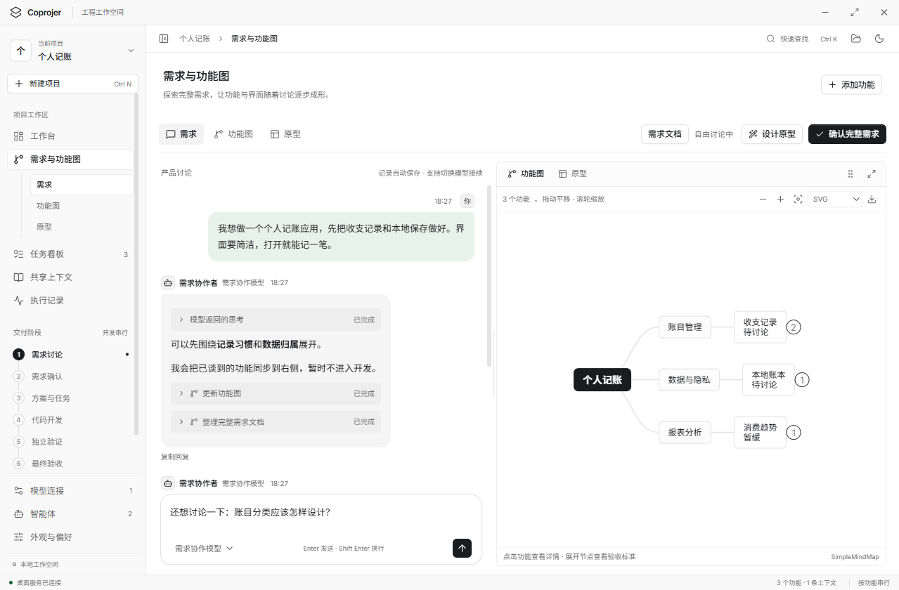

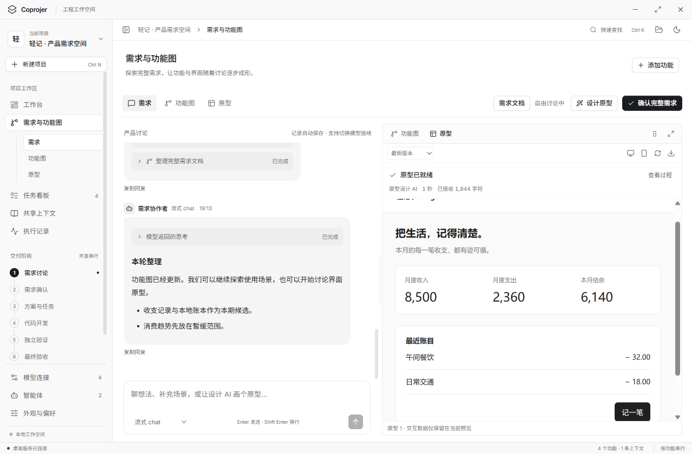

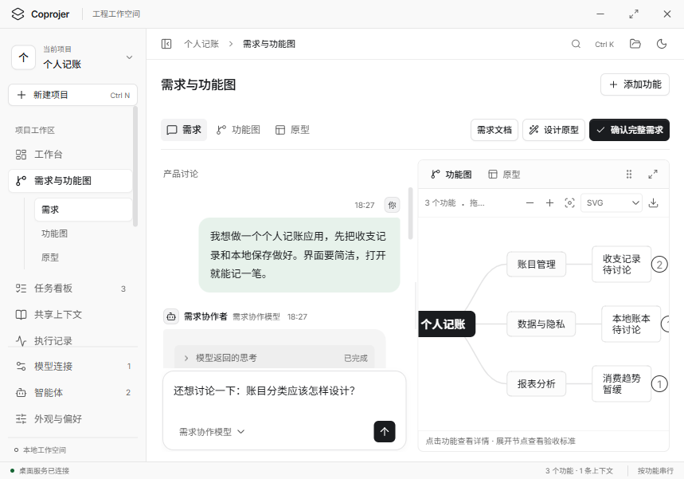

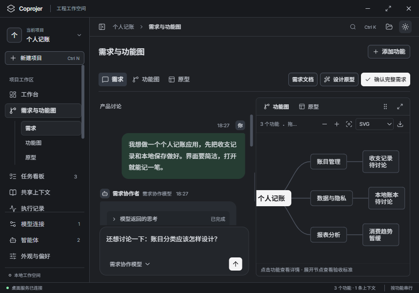

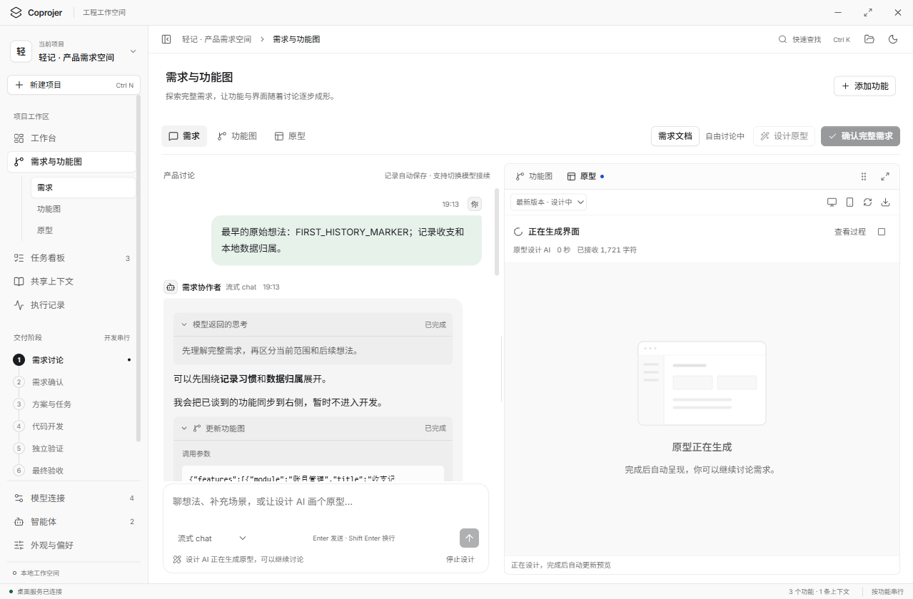

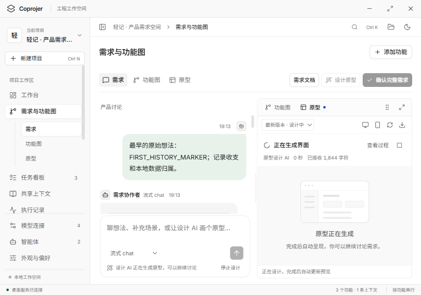

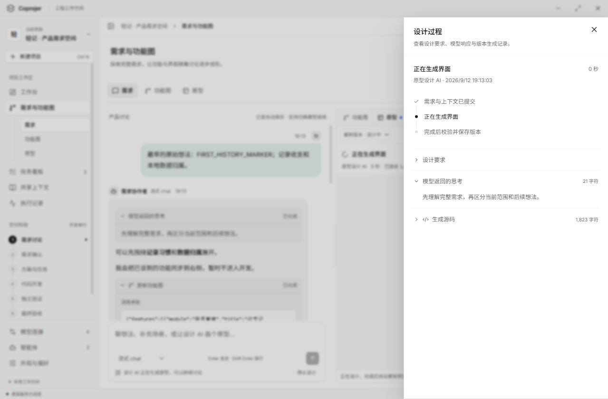

1.0 至 1.3 截图保留为历史，聊天沿用 1.3，其他页面继续沿用紧凑中性基础。

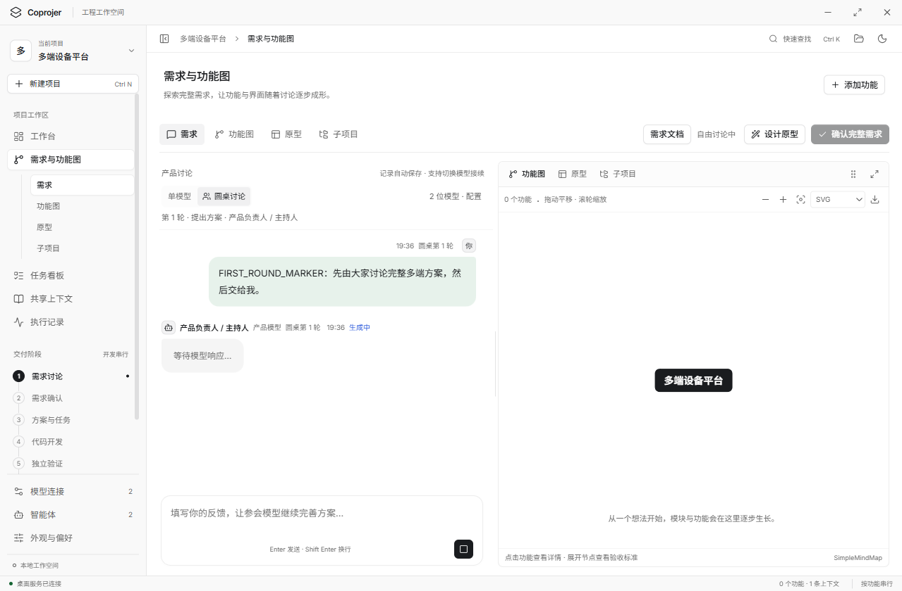

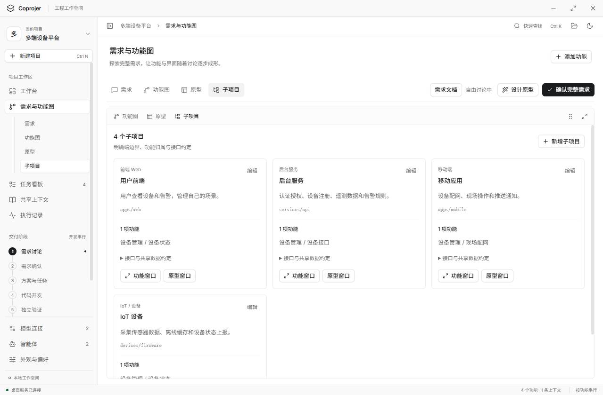

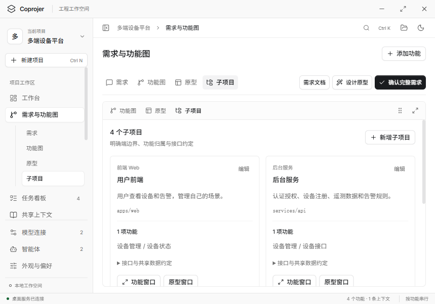

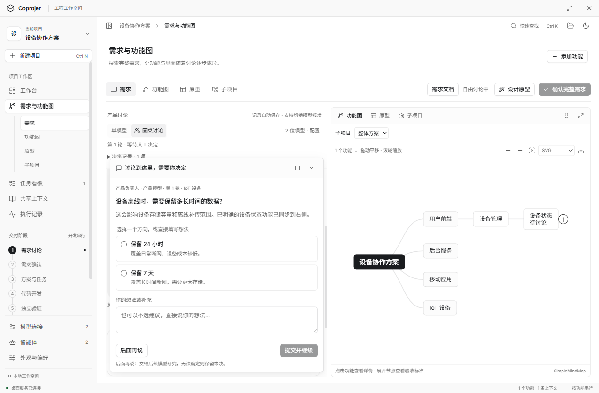

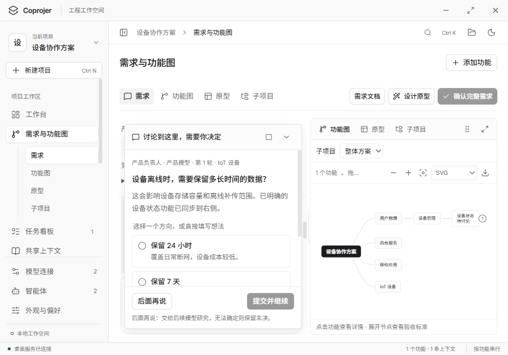

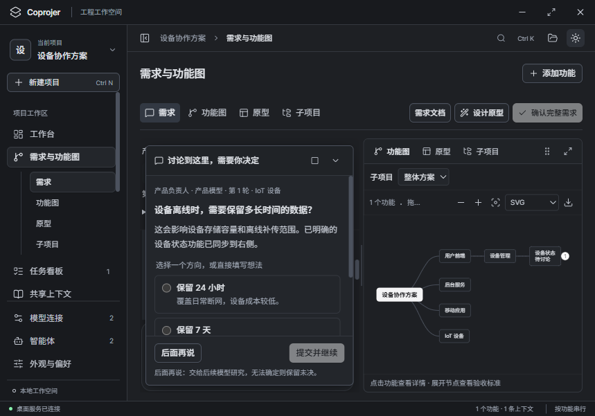

### 9.1 新手流程补充基线（2026-09-27）

沿用 UI 1.6 的中性配色、字号与密度。初步想法阶段主动收集设计意见；提交后进入完整原型视图，试用验收后自动生成 PRD，再进入需求审阅与方案设计。窄窗口合并状态提示，次要模型统计收进已有「查看过程」，保留试用和反馈空间。

以下截图来自隔离资料目录中的真实 Electron、本地确定性协议服务；原型业务内容为测试资料，不代表真实供应商输出或使用者项目已验收。完整截图在 [novice](ui/baseline-v1.6/novice/) 中。

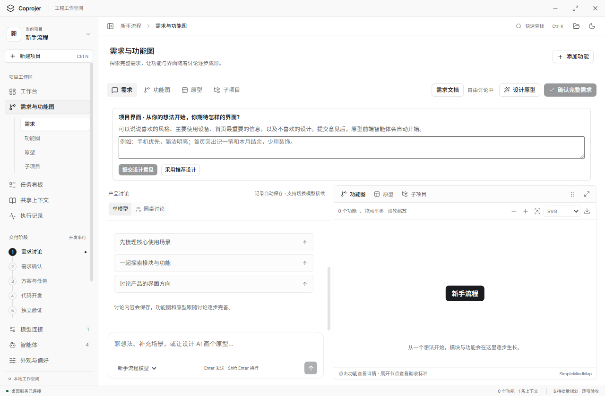

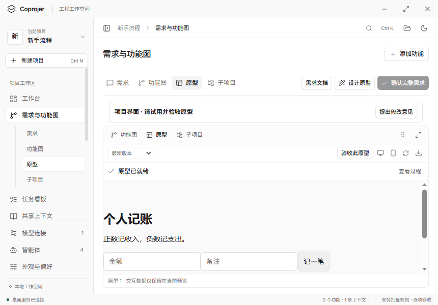

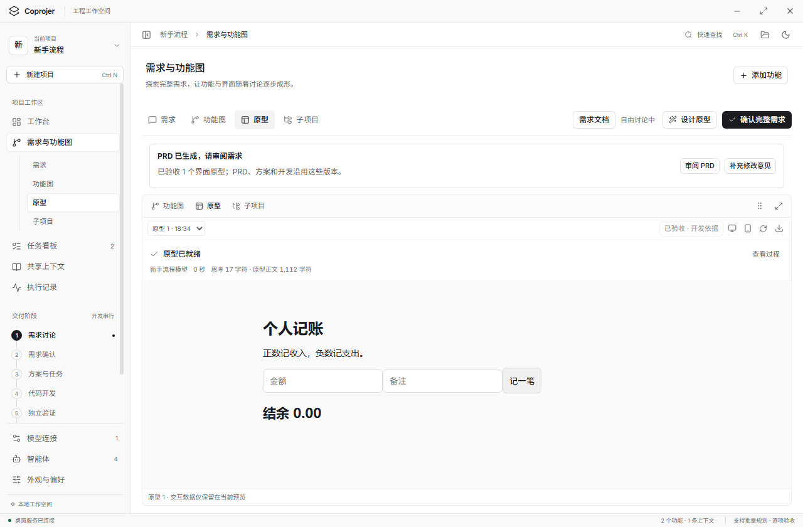

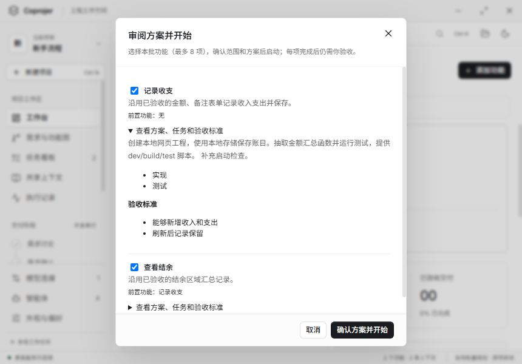

智能体技能配置、上下文取材记录及工作台的明暗主题也保存在同一目录；1280 × 840 与 860 × 600 的操作和布局均纳入新手流程测试。

## 10. 开发验收与变更

新增或修改 UI 时核对：

- 默认亮色、黑白强调色、紧凑字号是否保持；全局配色和字号是否复用现有变量与组件。
- 默认、悬停、按下、选中、焦点、禁用、加载和错误状态是否清楚且一致；状态色是否仍有文字或图标辅助。
- 1280 × 840 和 860 × 600 下是否无主页面横向溢出，长内容是否在正确区域滚动，操作是否可达。
- 暗色下是否可读，键盘顺序是否正常，减少动态效果是否生效。
- 运行 `npm run build`；涉及表单、弹窗、导航或持久化时验证对应真实 Electron 流程，基础冒烟检查使用 `npm test`。
- 文档变更只检查参数、路径与文档一致性，不需要重跑应用测试。

后续常规功能开发直接遵循本规范。用户明确提出风格调整时，同次更新规范版本、相关共享实现、变更记录与必要截图；已有授权不重复确认。纯功能扩展不应顺带重做全局配色、字体或密度。

`.scratch/` 内 UI 02、UI 03 和精修过程记录只保留历史背景，发生冲突时使用本规范。若发现实现与规范不一致，先按已确认需求识别偏差，再同步修正文档或实现，不能静默改写定稿基线。

| 版本 | 日期       | 变更                                                                       |
| ---- | ---------- | -------------------------------------------------------------------------- |
| 1.0  | 2026-09-12 | 固化当前亮色精修版：紧凑桌面布局、中性配色、文字层级、组件状态与交互反馈。 |
| 1.1 | 2026-09-12 | 移除演示和旧笔记界面，定稿单一侧栏、真实工程首页、功能清单、快捷查找与正式外观设置；沿用中性紧凑视觉。 |
| 1.2 | 2026-09-12 | 自由需求探索、流式讨论、完整需求文档、专业导图、原型预览与原生独立窗口；需求整体确认并保存共享基线。 |
| 1.3 | 2026-09-12 | 左右分布的灰色 / 淡绿聊天气泡、单层柔和输入焦点、自动增高输入区，以及保留阅读位置的流式滚动。 |
| 1.4 | 2026-09-12 | 原型预览优先，设计过程改为简洁状态栏与按需打开的侧边抽屉；思考、要求和源码分开排版，默认收起。 |
| 1.5 | 2026-09-12 | 圆桌多模型协作与人工反馈循环、多端子项目规划、功能归属和按项目区分的独立视窗；沿用既有视觉参数。 |
| 1.6 | 2026-09-12 | 圆桌中途逐张决策卡、选择与自由输入、后面再说与后续模型研究、决策记录及恢复；参会阶段动态更新功能图。 |
